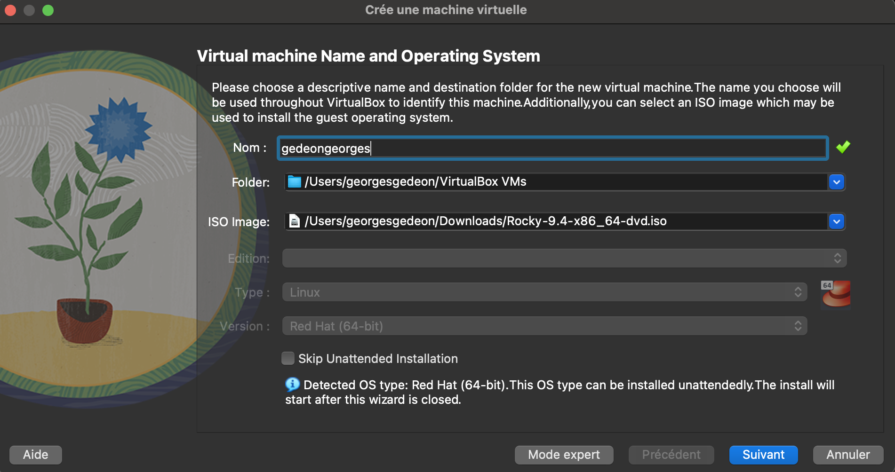
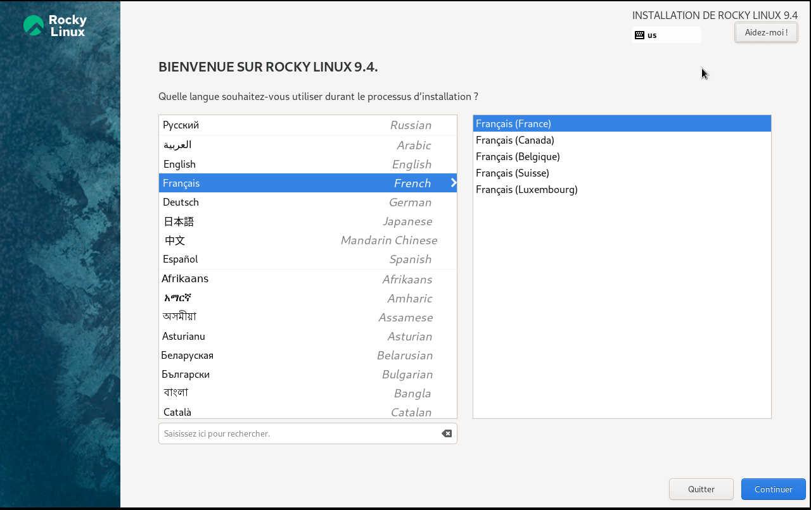

# Отчет по лабораторной работы №1

## Установка виртуальной машины

- Установка виртуальной машины в VirtualBox, система Rocky Linux

## Основные настройки

- Настройка языка

## Запуск виртуальной машины

## Работа с виртуальной машиной (Домашняя работа №1)

- На данном слайде представлено одно из заданий Домашней работы к лабораторной работе №1

## Работа с GitHub

## Основные команды git

- На следующем скриншоте представлены команды git, которые позволяют отправить созданные файлы на GitHub

## Выводы

- Установил VirtualBox, изучил её работу. 
- Научился работать с Markdown-файлами.
- Научился создавать pdf и docx файлы из файла Markdown (с помощью команды make)