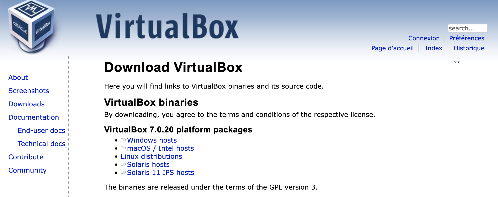

## РОССИЙСКИЙ УНИВЕРСИТЕТ ДРУЖБЫ НАРОДОВ
## Факультет физико-математических и естественных наук 
### Кафедра прикладной информатики и теории вероятностей

### ОТЧЕТ ПО ЛАБОРАТОРНОЙ РАБОТЕ № 1

*дисциплина: Основы информационной безопасности*

**Студент: ГЕОРГЕС Гедеон** 
**Группа: НПМбд-02-21**
**Студ. бил.:№ 1032204593**

МОСКВА 2024 г.

# Цель работы :
Целью данной работы является приобретение практических навыков
установки операционной системы на виртуальную машину, настройки минимально необходимых для дальнейшей работы сервисов.

# Задание :

Часть 1 
1.Установка и настройка виртуальной машины VirtualBox (ОС Linux)

Часть 2 
1.Создаем базовую конфигурацию для работы в git. 
2.Создаем ключ SSH. 
3.Создаем ключ PGP. 
4.Настройм установку git. 
5.Зарегистрировался на GitHub.

Часть 3 
1.Подготовлено лабораторными работами в формате Markdown. 2. Файл предзагружен в 3-х форматах: pdf, docx и md.

# Выполнение лабораторной работы

Часть 1. Установка и настройка Виртуальной машины VirtualBox

1)Зайдите на официальный сайт VirtualBox и скачайте файл. Установите VirtualBox на свой компьютер. Я часто использую Linux.

2)Создайте виртуальную машину. Для этого нажмите «Создать». Имя нашей виртуальной машины — GedeonGeorges. Выберите наш образ диска Rocky Linux. Чтобы он распознал его как образ, сначала скачиваем UltraISO. 

3)Виртуальной машине требуется оперативная память. Выделяем 4096 МБ, это половина основной оперативной памяти. Мы также даем ему 4 процессора.

4)Выделяем под виртуальную машину 40 ГБ памяти.

5)Включаем виртуальную машину, выбор языка.

6)Загрузите сеть и следуйте за ней.

7)Базовое окружение выбираем Сервер с GUI.

8)Установите пароль для пользователя root.

9)Установка завершена. Перезагрузить.

10)Создайте систему Rocky Linux. Установка завершена!

ДОМАШНЕЕ ЗАДАНИЕ №1:

1)Окно терминала подключается к системе, запустив
команда dmesg.

Вы можете добавить ссылку на grep:dmesg | grep -i "то, что мы ищем"
Команда grep используется для поиска данных.
a. Версия ядра Linux (версия Linux).

b. Частота процессора (Detected MHz processor).

c. Модель процессора (CPU0)

d. Объем доступной оперативной памяти (Memory available)

e. Тип обнаруженного гипервизора (Hypervisor detected).

f. Тип файловой системы корневого раздела. Последовательность монтирования
файловых систем

КОНТРОЛЬНЫЕ ВОПРОСЫ №1

1)Учётная запись пользователя содержит сведения, необходимые для идентификации пользователя при подключении к системе, такие как имя пользователя, имя хоста и пароль.
2)Команды терминала:
   a.Для получения справки используется ключ –help или команда man. Например, ls –help или man ls.
   b.Для перемещения по файловой системе используется команда cd. Например cd ~.
   c.Для просмотра содержимого каталога используется команда ls. Например ls ~/work.
   d.Для определения объёма каталога используется команда du.
   e.Для создания каталогов используется mkdir, для удаления пустых каталогов используется rmdir. Для создания файлов используется touch, для удаления файлов и каталог используется rm.
   f.Для задания прав используется команда chmod. Например, chmod u-w test.txt.
   g.Для просмотра истории команд используется команда history.
3)Файловая система — часть ОС, которая обеспечивает чтение и запись файлов на дисковых носителях информации.
   a.Ext2 — расширенная файловая система. Данные сначала кэшируются и только потом записываются на диск.
   b.Ext3 и Ext4 — журналируемые файловые системы. Осуществляется хранение в виде журнала со списком изменений, что помогает сохранить целостность при сбоях.
   c.XFS — высокопроизводительная журналируемая файловая система, рассчитанная для работы на дисках большого объёма.
4)Для просмотра подмонтированных в ОС файловых систем необходимо использовать команду findmht.
5)Для удаления зависшего процесса используется команда kill PID или killall название.

Часть 2. Работа с GitHub

1)Первым делом, мы регистрируемся на сайте github.com. Так как мы не в первый раз имеем дело с github, то аккаунт уже готов.

2)Первоначальная настройка для работы с github.

3)Генерация SSH ключа.

4)Переходим на сайте в настройки и в SSH Keys. Копируем наш SSH ключ, предварительно выведя его в консоль с помощью cat ~/.ssh/id_rsa.pub.

5)Ключ отобразился на сайте.

# Выводы

Я установил VirtualBox, поставил на виртуальную машину Rocky Linux. Скомпилировал файлы из формата md в pdf и docx.