## РОССИЙСКИЙ УНИВЕРСИТЕТ ДРУЖБЫ НАРОДОВ
## Факультет физико-математических и естественных наук 
### Кафедра прикладной информатики и теории вероятностей

### ОТЧЕТ ПО ЛАБОРАТОРНОЙ РАБОТЕ № 1

*дисциплина: Основы информационной безопасности*

**Студент: ГЕОРГЕС Гедеон** 
**Группа: НПМбд-02-21**
**Студ. бил.:№ 1032204593**

МОСКВА 2024 г.

# Цель работы :
Целью данной работы является приобретение практических навыков
установки операционной системы на виртуальную машину, настройки минимально необходимых для дальнейшей работы сервисов.

# Задание :

Часть 1 
1.Установка и настройка виртуальной машины VirtualBox (ОС Linux)

Часть 2 
1.Создаем базовую конфигурацию для работы в git. 
2.Создаем ключ SSH. 
3.Создаем ключ PGP. 
4.Настройм установку git. 
5.Зарегистрировался на GitHub.

Часть 3 
1.Подготовлено лабораторными работами в формате Markdown. 2. Файл предзагружен в 3-х форматах: pdf, docx и md.

# Выполнение лабораторной работы

Часть 1. Установка и настройка Виртуальной машины VirtualBox

1)Зайдите на официальный сайт VirtualBox и скачайте файл. Установите VirtualBox на свой компьютер. Я часто использую Linux.

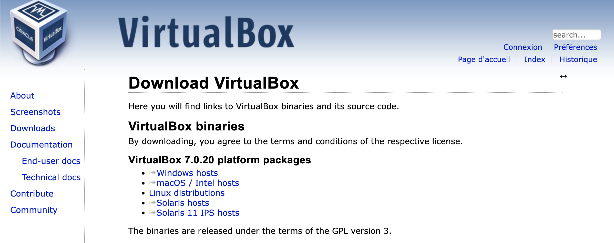

2)Создайте виртуальную машину. Для этого нажмите «Создать». Имя нашей виртуальной машины — GedeonGeorges. Выберите наш образ диска Rocky Linux. Чтобы он распознал его как образ, сначала скачиваем UltraISO. 

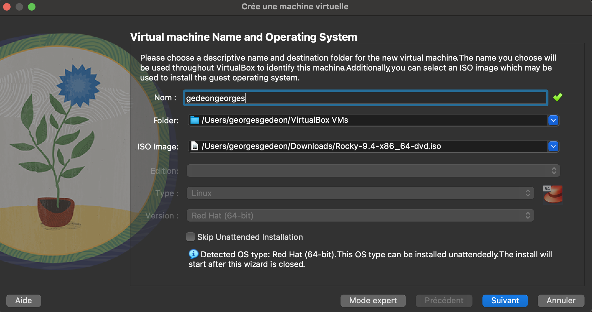

3)Виртуальной машине требуется оперативная память. Выделяем 4096 МБ, это половина основной оперативной памяти. Мы также даем ему 4 процессора.

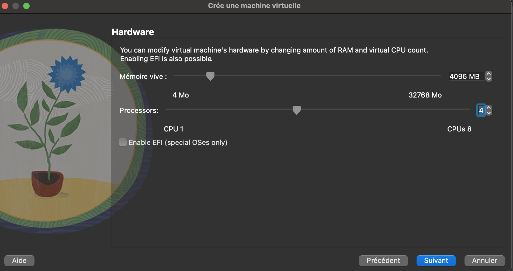

4)Выделяем под виртуальную машину 40 ГБ памяти.

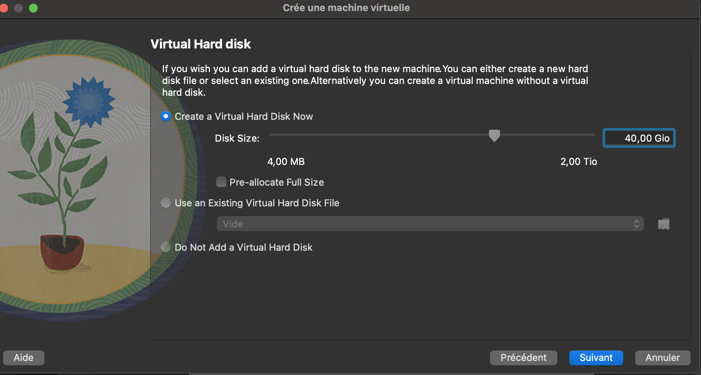

5)Включаем виртуальную машину, выбор языка.

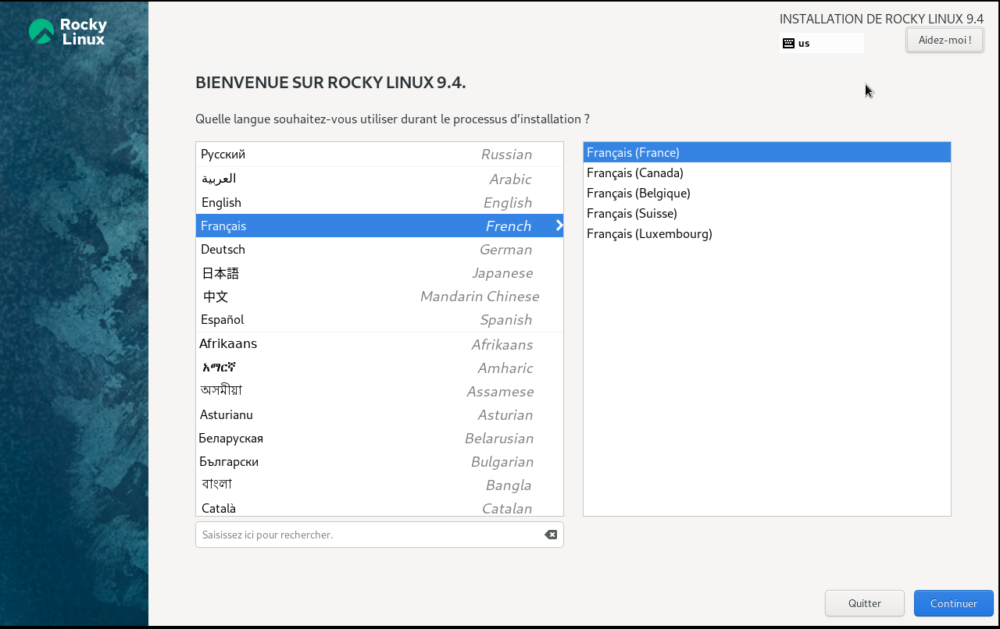

6)Загрузите сеть и следуйте за ней.

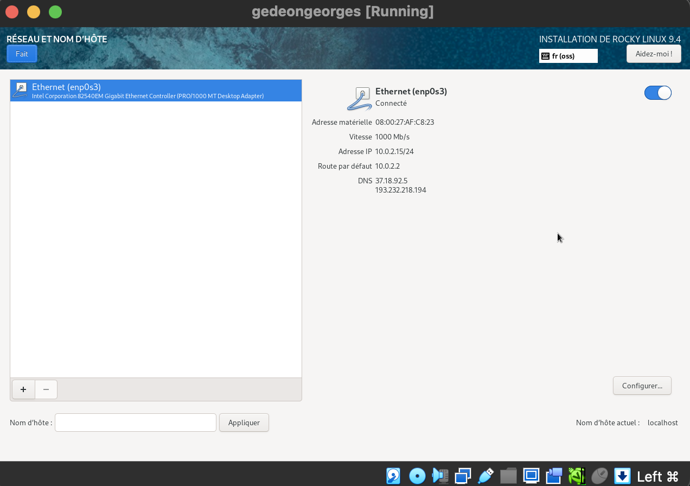

7)Базовое окружение выбираем Сервер с GUI.

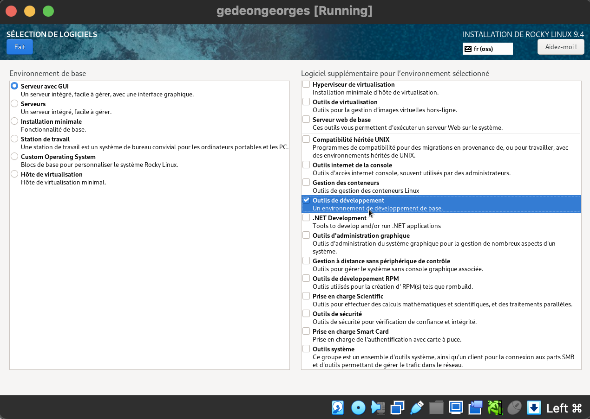

8)Установите пароль для пользователя root.

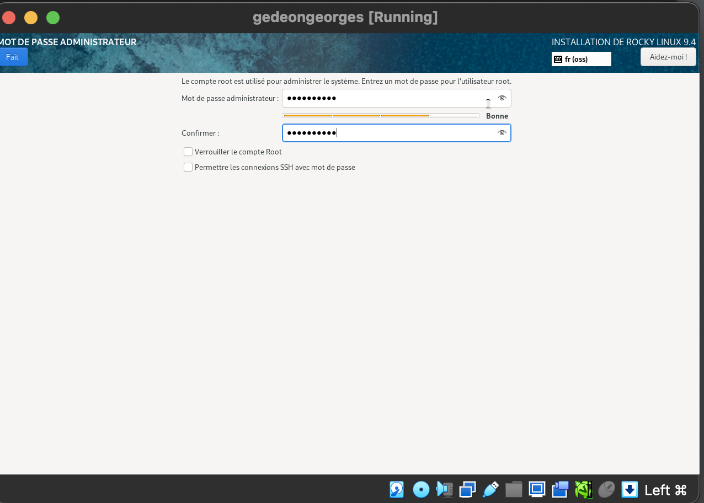

9)Установка завершена. Перезагрузить.

10)Создайте систему Rocky Linux. Установка завершена!

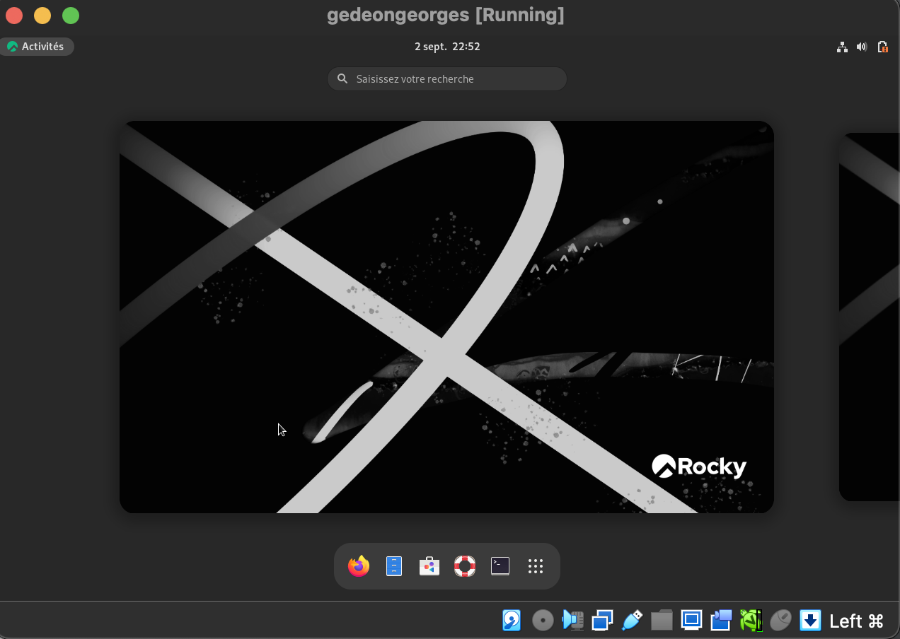

ДОМАШНЕЕ ЗАДАНИЕ №1:

1)Окно терминала подключается к системе, запустив
команда dmesg.

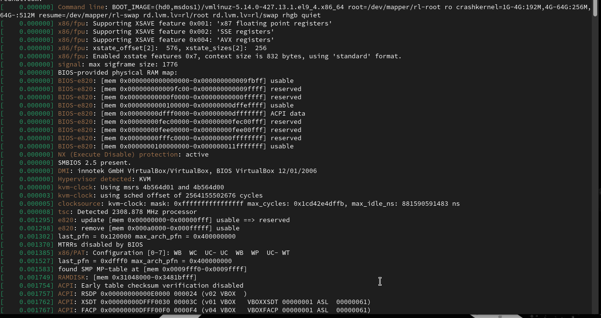

Вы можете добавить ссылку на grep:dmesg | grep -i "то, что мы ищем"
Команда grep используется для поиска данных.
a. Версия ядра Linux (версия Linux).

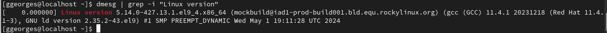

b. Частота процессора (Detected MHz processor).

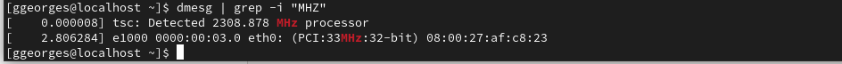

c. Модель процессора (CPU0)

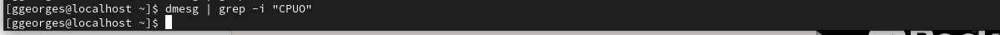

d. Объем доступной оперативной памяти (Memory available)

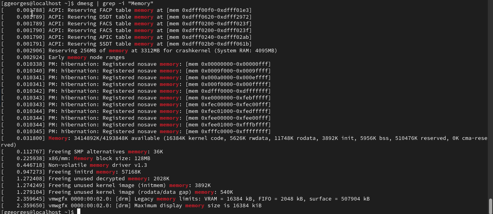

e. Тип обнаруженного гипервизора (Hypervisor detected).

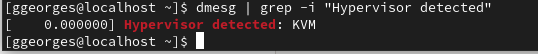

f. Тип файловой системы корневого раздела. Последовательность монтирования
файловых систем

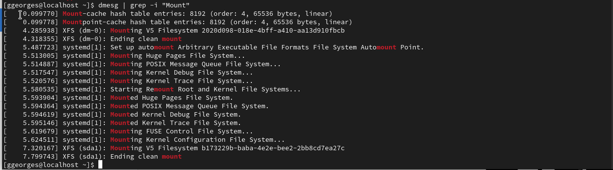

КОНТРОЛЬНЫЕ ВОПРОСЫ №1

1)Учётная запись пользователя содержит сведения, необходимые для идентификации пользователя при подключении к системе, такие как имя пользователя, имя хоста и пароль.

2)Команды терминала:
   a.Для получения справки используется ключ –help или команда man. Например, ls –help или man ls.
   b.Для перемещения по файловой системе используется команда cd. Например cd ~.
   c.Для просмотра содержимого каталога используется команда ls. Например ls ~/work.
   d.Для определения объёма каталога используется команда du.
   e.Для создания каталогов используется mkdir, для удаления пустых каталогов используется rmdir. Для создания файлов используется touch, для удаления файлов и каталог используется rm.
   f.Для задания прав используется команда chmod. Например, chmod u-w test.txt.
   g.Для просмотра истории команд используется команда history.

3)Файловая система — часть ОС, которая обеспечивает чтение и запись файлов на дисковых носителях информации.
   a.Ext2 — расширенная файловая система. Данные сначала кэшируются и только потом записываются на диск.
   b.Ext3 и Ext4 — журналируемые файловые системы. Осуществляется хранение в виде журнала со списком изменений, что помогает сохранить целостность при сбоях.
   c.XFS — высокопроизводительная журналируемая файловая система, рассчитанная для работы на дисках большого объёма.

4)Для просмотра подмонтированных в ОС файловых систем необходимо использовать команду findmht.

5)Для удаления зависшего процесса используется команда kill PID или killall название.

Часть 2. Работа с GitHub

1)Первым делом, мы регистрируемся на сайте github.com. Так как мы не в первый раз имеем дело с github, то аккаунт уже готов.

2)Первоначальная настройка для работы с github.

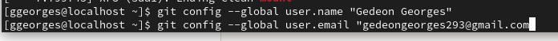

3)Генерация SSH ключа.

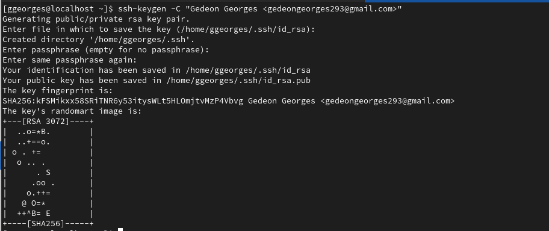

4)Переходим на сайте в настройки и в SSH Keys. Копируем наш SSH ключ, предварительно выведя его в консоль с помощью cat ~/.ssh/id_rsa.pub.

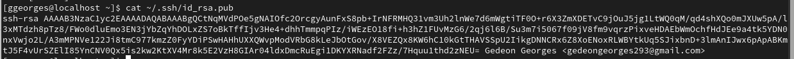

5)Ключ отобразился на сайте.

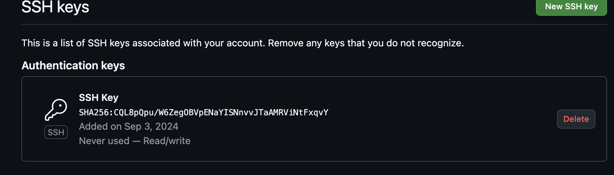

КОНТРОЛЬНЫЕ ВОПРОСЫ №2:

1)Система контроля версий Git представляетсобой набор программ командной строки.Доступ к ним можно получить изтерминала посредством ввода командыgitс различ-ными опциями. Системы контроля версий (Version Control System,VCS)применяются при работе нескольких человек над одним проектом.

2)В классических системах контроля версий используется централизованная модель, предполагающая наличие единого репозитория для хранения файлов. Выполнение большинства функций по управлению версиями осуществляется специальным сервером.Участник проекта (пользователь) перед началом работы посредством определённыхкоманд получает нужную ему версию файлов. После внесения изменений, пользователь размещает новую версию в хранилище. При этом предыдущие версии не удаляютсяиз центрального хранилища и к ним можно вернуться в любой момент. Сервер может сохранять неполную версию изменённых файлов, а производить так называемую дельта-компрессию—сохранять только изменения между последовательными версиями,чтопозволяет уменьшить объём хранимых данных.
Системы контроля версий также могут обеспечивать дополнительные, более гибкие функциональные возможности. Например,они могут поддерживать работу с нескольки-ми версиями одного файла,сохраняя общую историю изменений до точки ветвления версий и собственные истории изменений каждой ветви. Крометого, обычно доступна информация о том, кто из участников, когда и какие изменения вносил. Обычно такого рода информация хранится в журнале изменений, доступ к которому можно ограничить.

3)Централизованные системы — это системы, которые используют архитектуру клиент / сервер, где один или несколько клиентских узлов напрямую подключены к центральному серверу. Пример - Wikipedia.
В децентрализованных системах каждый узел принимает свое собственное решение. Конечное поведение системы является совокупностью решений отдельных узлов. Пример — Bitcoin.
В классических системах контроля версий используется централизованная модель, предполагающая наличие единого репозитория для хранения файлов.Выполнение большинства функций по управлению версиями осуществляется специальным сервером. 

4)Создадим локальный репозиторий. Сначала сделаем предварительную конфигурацию, указав имя и email владельца репозитория:
git config --global user.name"Имя Фамилия"
git config --global user.email"Project24@mail"
и настроив utf-8 в выводе сообщенийgit:
git config --global quotepath false
Для инициализации локального репозитория, расположенного, например, в каталоге ~/tutorial, необходимо ввести в командной строке:
cd
mkdir tutorial
cd tutorial
git init

5)Для последующей идентификации пользователя на сервере репозиториев необходимо сгенерировать пару ключей (приватный и открытый):
ssh-keygen -C"Имя Фамилия <Project24@mail>"
Ключи сохраняться в каталоге~/.ssh/.
Скопировав из локальной консоли ключ в буфер обмена
cat ~/.ssh/id_rsa.pub | xclip -sel clip
вставляем ключ в появившееся на сайте поле.

6)У Git две основных задачи: первая — хранить информацию о всех изменениях в вашем коде, начиная с самой первой строчки, а вторая — обеспечение удобства командной работы над кодом.

7)Основные команды git:
Наиболее часто используемые команды git: – создание основного дерева репозитория:git init–получение обновлений (изменений)текущего дерева из центрального репозитория:git pull–отправка всех произведённых изменений локального дерева в центральный репози-торий:git push–просмотр списка изменённых файлов втекущей директории:git status–просмотртекущих изменения:git diff–сохранениетекущих изменений:–добавить все изменённые и/или созданные файлы и/или каталоги:git add .–добавить конкретные изменённые и/или созданные файлы и/или каталоги:git add имена_файлов – удалить файл и/или каталог из индекса репозитория (приэтомфайл и/илик аталог остаётся в локальной директории): git rm имена_файлов – сохранение добавленных изменений: – сохранить все добавленные изменения и все изменённые файлы: git commit -am 'Описание коммита'–сохранить добавленные изменения с внесением комментария через встроенный редактор:git commit–создание новой ветки, базирующейся натекущей: git checkout -b имя_ветки–переключение на некоторую ветку: git checkout имя_ветки (при переключении на ветку, которой ещё нет в локальном репозитории, она будет создана и связана с удалённой) – отправка изменений конкретной ветки в центральный репозиторий: git push origin имя_ветки–слияние ветки стекущим деревом:git merge --no-ff имя_ветки–удаление ветки: – удаление локальной уже слитой с основным деревом ветки:git branch -d имя_ветки–принудительное удаление локальной ветки:git branch -D имя_ветки–удаление ветки с центрального репозитория: git push origin :имя_ветки

8)Использования git при работе с локальными репозиториями (добавления текстового документа в локальный репозиторий):
git add hello.txt
git commit -am'Новый файл

9)Проблемы, которые решают ветки git:
    • нужно постоянно создавать архивы с рабочим кодом 
    • сложно "переключаться" между архивами 
    • сложно перетаскивать изменения между архивами 
    • легко что-то напутать или потерять

10)Во время работы над проектомтак или иначе могутсоздаваться файлы,которые нетребуется добавлять в последствии в репозиторий. Например, временные файлы, со-здаваемые редакторами,или объектные файлы, создаваемые компиляторами.Можно прописать шаблоны игнорируемых при добавлении в репозиторийтипов файлов в файл.gitignore с помощьюс ервисов. Для этого сначала нужно получить списоки меющихся шаблонов: curl -L -s https://www.gitignore.io/api/list
Затем скачать шаблон,например, для C и C++ 
curl -L -s https://www.gitignore.io/api/c >> .gitignore
curl -L -s https://www.gitignore.io/api/c++ >> .gitignore

# Выводы

Я установил VirtualBox, поставил на виртуальную машину Rocky Linux. Скомпилировал файлы из формата md в pdf и docx.