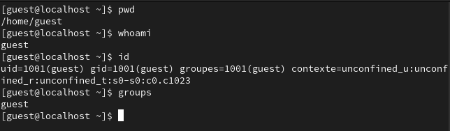
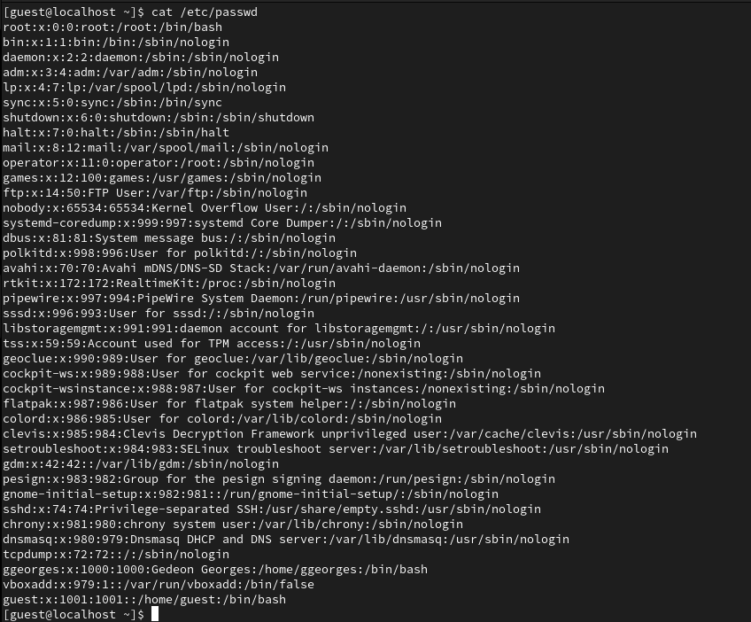
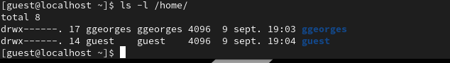
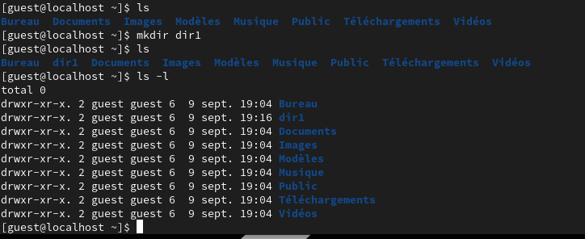

---
# Front matter
lang: ru-RU
title: "Лабораторная работа №2"
subtitle: "Дисциплина: Основы информационной безопасности"
author: "Георгес Гедеон"

# Formatting
toc-title: "Содержание"
toc: true # Table of contents
toc_depth: 2
lof: true # Список рисунков
lot: true # Список таблиц
fontsize: 12pt
linestretch: 1.5
papersize: a4paper
documentclass: scrreprt
polyglossia-lang: russian
polyglossia-otherlangs: english
mainfont: PT Serif
romanfont: PT Serif
sansfont: PT Sans
monofont: PT Mono
mainfontoptions: Ligatures=TeX
romanfontoptions: Ligatures=TeX
sansfontoptions: Ligatures=TeX,Scale=MatchLowercase
monofontoptions: Scale=MatchLowercase
indent: true
pdf-engine: lualatex
header-includes:
  - \linepenalty=10 # the penalty added to the badness of each line within a paragraph (no associated penalty node) Increasing the value makes tex try to have fewer lines in the paragraph.
  - \interlinepenalty=0 # value of the penalty (node) added after each line of a paragraph.
  - \hyphenpenalty=50 # the penalty for line breaking at an automatically inserted hyphen
  - \exhyphenpenalty=50 # the penalty for line breaking at an explicit hyphen
  - \binoppenalty=700 # the penalty for breaking a line at a binary operator
  - \relpenalty=500 # the penalty for breaking a line at a relation
  - \clubpenalty=150 # extra penalty for breaking after first line of a paragraph
  - \widowpenalty=150 # extra penalty for breaking before last line of a paragraph
  - \displaywidowpenalty=50 # extra penalty for breaking before last line before a display math
  - \brokenpenalty=100 # extra penalty for page breaking after a hyphenated line
  - \predisplaypenalty=10000 # penalty for breaking before a display
  - \postdisplaypenalty=0 # penalty for breaking after a display
  - \floatingpenalty = 20000 # penalty for splitting an insertion (can only be split footnote in standard LaTeX)
  - \raggedbottom # or \flushbottom
  - \usepackage{float} # keep figures where there are in the text
  - \floatplacement{figure}{H} # keep figures where there are in the text
---

# Цель работы

Получение практических навыков работы в консоли с атрибутами файлов, закрепление теоретических основ дискреционного разграничения доступа в современных системах с открытым кодом на базе ОС Linux.

# Выполнение лабораторной работы

1)С помощью команды useradd guest создаём в этой операционной системе ещё одного пользователя - guest. 
С помощью команды passwd guest устанавливаем пароль для пользователя guest. Перед всеми командами мы прописываем sudo, который дает нам права пользователя.

2)Выходим из нашего пользователя и входим от имени пользователя guest. 

3)Зашли от имени пользователя guest. Открыли терминал. Пишем команду pwd, которая покажет нам директорию, в которой мы находимся. Мы находимся в директории /home/guest. 
С приглашением командной строки совпадает. Мы находимся в домашней директории. 
С помощью команды whoami мы уточняем имя нашего пользователя. Имя - guest. 
Вывод команды id покажет нам имя пользователя, его группу, а также группы, куда входит пользователь(uid, gid и др.). Запомним вывод этой команды. Команда groups выводит нам группы, в которых мы состоим. 
Сравниваем полученную информацию об имени пользователя с данными, выводимыми в приглашении командной строки. Они совпадают.

4)Просматриваем файл /etc/passwd с помощью cat. Наш пользователь guest находится внизу списка. uid и gid пользователя совпадает с выводом прошлых команд. 
Чтобы вывести только нашего пользователя guest, проще применить после команду grep, которая делает поиск по файлу.

5)С помощью команды ls -l /home/ смотрим директории в нашей системе. Видим две директории: одна гостевая(guest), другая моя(gedeongeorges). Мне удалось получить список поддиректорий директории /home.
На директориях установлены права чтения, записи и выполнения для самого пользователя(для группы и остальных пользователей никаких прав доступа не установлено).
С помощью команды lsattr /home посмотрим, какие расширенные атрибуты стоят на директориях. И мне сразу выдаёт, что у меня, как у гостя, нет таких прав.

6)Создаём директорию dir1 с помощью команды mkdir. С помощью команды ls -l посмотрим, какие права доступа и расширенные атрибуты были выставлены на директорию. Чтение, запись и выполнение доступны для самого пользователя и для группы, для остальных - только чтение и выполнение, расширенных атрибутов не установлено.

7)Снимаем с директории dir1 все атрибуты командой chmod. И сразу же посмотрим, что изменилось с помощью команды ls -l. Как мы видим, мы убрали права с файла. А именно: чтение, запись и выполнение.

8)Пытаемся создать в директории dir1 файл file1 командой echo "test" > /home/guest/dir1/file1. Как мы видим, ничего не получается, так как в прошлом пункте мы забрали право на запись в директории. 
Стоит отметить, что в саму директорию теперь зайти также нельзя, по той же причине. Чтобы убедиться в том, что файл не был создан, дадим право на чтение директории. Просмотрев директорию, мы не обнаруживаем там файла, который мы пытались создать.

9)Заполним таблицу "Установленные права и разрешённые действия". Нужно заполнить 64 ячейки.

Создание файла: echo”text” > /home/guest/dir1/file2
Удаление файла: rm -r /home/guest/dir1/file1
Запись в файл: echo”textnew” > /home/guest/dir1/file1
Чтение файла: cat /home/guest/dir1/file1
Смена директории: cd dir1
Просмотр файлов в директории: ls dir1
Переименование файла: mv /home/guest/dir1/file1 filenew
Смена атрибутов файла: chattr -a /home/guest/dir1/file1

| Права директории | Права файла | Создание файла | Удаление файла | Запись в файл | Чтение файла | Смена директории | Просмотр файлов в директории | Переименование файла | Смена атрибутов файла |
|------------------|-------------|----------------|----------------|---------------|--------------|------------------|------------------------------|----------------------|-----------------------|
| d (000)          | (000)       | -              | -              | -             | -            | -                | -                            | -                    | -                     |
| d –x (100)       | (000)       | -              | -              | -             | -            | +                | -                            | -                    | -                     |
| d -w- (200)      | (000)       | -              | -              | -             | -            | -                | -                            | -                    | -                     |
| d -wx (300)      | (000)       | +              | +              | -             | -            | +                | -                            | +                    | -                     |
| d r– (400)       | (000)       | -              | -              | -             | -            | -                | +                            | -                    | -                     |
| d r-x (500)      | (000)       | -              | -              | -             | -            | +                | +                            | -                    | -                     |
| d rw- (600)      | (000)       | -              | -              | -             | -            | -                | +                            | -                    | -                     |
| d rwx (700)      | (000)       | +              | +              | -             | -            | +                | +                            | +                    | -                     |
|------------------|-------------|----------------|----------------|---------------|--------------|------------------|------------------------------|----------------------|-----------------------|
| d (000)          | (100)       | -              | -              | -             | -            | -                | -                            | -                    | -                     |
| d –x (100)       | (100)       | -              | -              | -             | -            | +                | -                            | -                    | -                     |
| d -w- (200)      | (100)       | -              | -              | -             | -            | -                | -                            | -                    | -                     |
| d -wx (300)      | (100)       | +              | +              | -             | -            | +                | -                            | +                    | -                     |
| d r– (400)       | (100)       | -              | -              | -             | -            | -                | +                            | -                    | -                     |
| d r-x (500)      | (100)       | -              | -              | -             | -            | +                | +                            | -                    | -                     |
| d rw- (600)      | (100)       | -              | -              | -             | -            | -                | +                            | -                    | -                     |
| d rwx (700)      | (100)       | +              | +              | -             | -            | +                | +                            | +                    | -                     |
|------------------|-------------|----------------|----------------|---------------|--------------|------------------|------------------------------|----------------------|-----------------------|
| d (000)          | (200)       | -              | -              | -             | -            | -                | -                            | -                    | -                     |
| d –x (100)       | (200)       | -              | -              | +             | -            | +                | -                            | -                    | -                     |
| d -w- (200)      | (200)       | -              | -              | -             | -            | -                | -                            | -                    | -                     |
| d -wx (300)      | (200)       | +              | +              | +             | -            | +                | -                            | +                    | -                     |
| d r– (400)       | (200)       | -              | -              | -             | -            | -                | +                            | -                    | -                     |
| d r-x (500)      | (200)       | -              | -              | +             | -            | +                | +                            | -                    | -                     |
| d rw- (600)      | (200)       | -              | -              | -             | -            | -                | +                            | -                    | -                     |
| d rwx (700)      | (200)       | +              | +              | +             | -            | +                | +                            | +                    | -                     |
|------------------|-------------|----------------|----------------|---------------|--------------|------------------|------------------------------|----------------------|-----------------------|
| d (000)          | (300)       | -              | -              | -             | -            | -                | -                            | -                    | -                     |
| d –x (100)       | (300)       | -              | -              | +             | -            | +                | -                            | -                    | -                     |
| d -w- (200)      | (300)       | -              | -              | -             | -            | -                | -                            | -                    | -                     |
| d -wx (300)      | (300)       | +              | +              | -             | +            | +                | -                            | +                    | -                     |
| d r– (400)       | (300)       | -              | -              | -             | -            | -                | +                            | -                    | -                     |
| d r-x (500)      | (300)       | -              | -              | +             | -            | +                | +                            | -                    | -                     |
| d rw- (600)      | (300)       | -              | -              | -             | -            | -                | +                            | -                    | -                     |
| d rwx (700)      | (300)       | +              | +              | +             | -            | +                | +                            | +                    | -                     |
|------------------|-------------|----------------|----------------|---------------|--------------|------------------|------------------------------|----------------------|-----------------------|
| d (000)          | (400)       | -              | -              | -             | -            | -                | -                            | -                    | -                     |
| d –x (100)       | (400)       | -              | -              | -             | +            | +                | -                            | -                    | +                     |
| d -w- (200)      | (400)       | -              | -              | -             | -            | -                | -                            | -                    | -                     |
| d -wx (300)      | (400)       | +              | +              | -             | +            | +                | -                            | +                    | +                     |
| d r– (400)       | (400)       | -              | -              | -             | -            | -                | +                            | -                    | -                     |
| d r-x (500)      | (400)       | -              | -              | -             | +            | +                | +                            | -                    | +                     |
| d rw- (600)      | (400)       | -              | -              | -             | -            | -                | +                            | -                    | -                     |
| d rwx (700)      | (400)       | +              | +              | -             | +            | +                | +                            | +                    | +                     |
|------------------|-------------|----------------|----------------|---------------|--------------|------------------|------------------------------|----------------------|-----------------------|
| d (000)          | (500)       | -              | -              | -             | -            | -                | -                            | -                    | -                     |
| d –x (100)       | (500)       | -              | -              | -             | +            | +                | -                            | -                    | +                     |
| d -w- (200)      | (500)       | -              | -              | -             | -            | -                | -                            | -                    | -                     |
| d -wx (300)      | (500)       | +              | +              | -             | +            | +                | -                            | +                    | +                     |
| d r– (400)       | (500)       | -              | -              | -             | -            | -                | +                            | -                    | -                     |
| d r-x (500)      | (500)       | -              | -              | -             | +            | +                | +                            | -                    | +                     |
| d rw- (600)      | (500)       | -              | -              | -             | -            | -                | +                            | -                    | -                     |
| d rwx (700)      | (500)       | +              | +              | -             | +            | +                | +                            | +                    | +                     |
|------------------|-------------|----------------|----------------|---------------|--------------|------------------|------------------------------|----------------------|-----------------------|
| d (000)          | (600)       | -              | -              | -             | -            | -                | -                            | -                    | -                     |
| d –x (100)       | (600)       | -              | -              | +             | +            | +                | -                            | -                    | +                     |
| d -w- (200)      | (600)       | -              | -              | -             | -            | -                | -                            | -                    | -                     |
| d -wx (300)      | (600)       | +              | +              | +             | +            | +                | -                            | +                    | +                     |
| d r– (400)       | (600)       | -              | -              | -             | -            | -                | +                            | -                    | -                     |
| d r-x (500)      | (600)       | -              | -              | +             | +            | +                | +                            | -                    | +                     |
| d rw- (600)      | (600)       | -              | -              | -             | -            | -                | +                            | -                    | -                     |
| d rwx (700)      | (600)       | +              | +              | +             | +            | +                | +                            | +                    | +                     |
|------------------|-------------|----------------|----------------|---------------|--------------|------------------|------------------------------|----------------------|-----------------------|
| d (000)          | (700)       | -              | -              | -             | -            | -                | -                            | -                    | -                     |
| d –x (100)       | (700)       | -              | -              | +             | +            | +                | -                            | -                    | +                     |
| d -w- (200)      | (700)       | -              | -              | -             | -            | -                | -                            | -                    | -                     |
| d -wx (300)      | (700)       | +              | +              | +             | +            | +                | -                            | +                    | +                     |
| d r– (400)       | (700)       | -              | -              | -             | -            | -                | +                            | -                    | -                     |
| d r-x (500)      | (700)       | -              | -              | +             | +            | +                | +                            | -                    | +                     |
| d rw- (600)      | (700)       | -              | -              | -             | -            | -                | +                            | -                    | -                     |
| d rwx (700)      | (700)       | +              | +              | +             | +            | +                | +                            | +                    | +                     |

10)Заполним таблицу "Минимальные права для совершения операций".

| Операция               | Минимальные права на директорию | Минимальные права на файл |
|------------------------|---------------------------------|---------------------------|
| Создание файла         | d -wx (300)                     | (000)                     |
| Удаление файла         | d -wx (300)                     | (000)                     |
| Чтение файла           | d –x (100)                      | (400)                     |
| Запись в файл          | d –x (100)                      | (200)                     |
| Переименование файла   | d -wx (300)                     | (000)                     |
| Создание поддиректории | d -wx (300)                     | (000)                     |
| Удаление поддиректории | d -wx (300)                     | (000)                     |

# Выводы

Я приобрел практические навыки работы с файлами, связанными с консолью, и на базе ОС Linux,закрепил теоретические основы дискреционного контроля доступа в современных системах с открытым исходным кодом.

# Список литературы

- Права доступа к файлам в Linux[Электронный ресурс]. 2019. URL: https://losst.ru/prava-dostupa-k-fajlam-v-linux.
