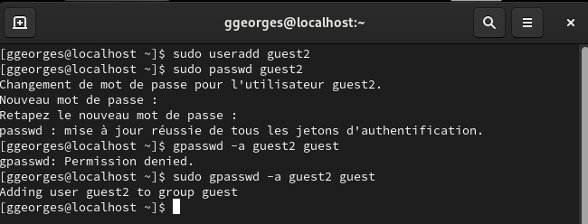
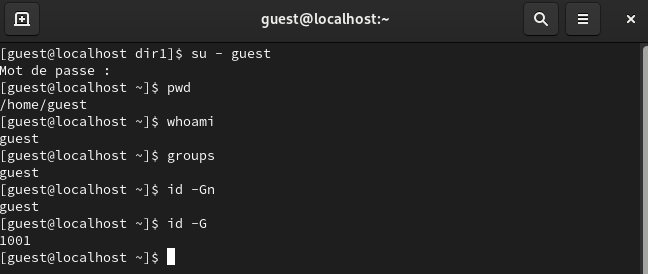
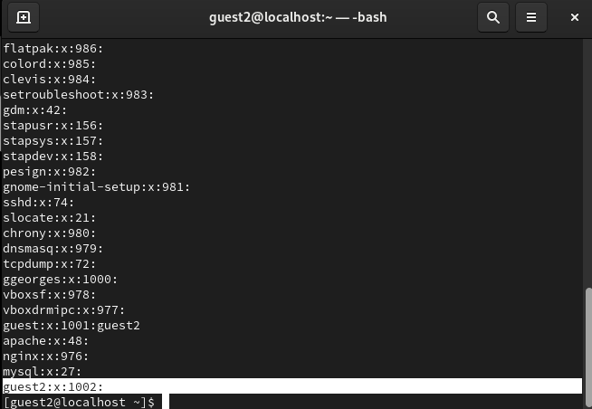
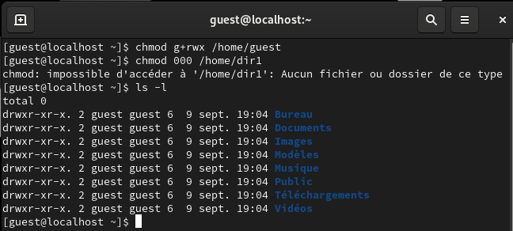

---
## Front matter
lang: ru-RU
title: Отчёт по лабораторной работе №3
author: Георгес Гедеон
institute: РУДН, Москва, Россия

date: 21 Сентября 2024

## Formatting
toc: false
slide_level: 2
theme: metropolis
header-includes: 
 - \metroset{progressbar=frametitle,sectionpage=progressbar,numbering=fraction}
 - '\makeatletter'
 - '\beamer@ignorenonframefalse'
 - '\makeatother'
aspectratio: 43
section-titles: true
---

# Отчет по лабораторной работе №3

##

Цель работы: Получение практических навыков работы в консоли с атрибутами файлов для групп пользователей.

## 

В операционной системе Linux есть много отличных функций безопасности, но одна из самых важных - это система прав доступа к файлам. Изначально каждый файл имел три параметра доступа. Вот они:
• Чтение - разрешает получать содержимое файла, но на запись нет. Для каталога позволяет получить список файлов и каталогов, расположенных в нем 
• Запись - разрешает записывать новые данные в файл или изменять существующие, а также позволяет создавать и изменять файлы и каталоги
• Выполнение - невозможно выполнить программу, если у нее нет флага выполнения. Этот атрибут устанавливается для всех программ и скриптов, именно с помощью него система может понять, что этот файл нужно запускать как программу

Каждый файл имеет три категории пользователей, для которых можно устанавливать различные сочетания прав доступа:
• Владелец - набор прав для владельца файла, пользователя, который его создал или сейчас установлен его владельцем. Обычно владелец имеет все права, чтение, запись и выполнение
• Группа - любая группа пользователей, существующая в системе и привязанная к файлу. Но это может быть только одна группа и обычно это группа владельца, хотя для файла можно назначить и другую группу
• Остальные - все пользователи, кроме владельца и пользователей, входящих в группу файла

## 

В установленной при выполнении предыдущей лабораторной работы ОС создаём учётную запись пользователя guest2(т.к. пользователь guest уже был создан в прошлой лабораторной работе) 
с помощью команды “sudo useradd guest2” и задаём пароль для этого пользователя командой “sudo passwd guest2”. 
Добавляем пользователя guest2 в группу guest с помощью команды “sudo gpasswd -a guest2 guest”(Рисунок 1).

##  

Затем осуществляем вход в систему от двух пользователей на двух разных консолях при помощи команд “su - guest” и “su - guest2”. Определяем командой “pwd”,
что оба пользователя находятся в своих домашних директориях, что совпадает с приглашениями командной строки. Уточняем имена пользователей командой 
“whoami”, получаем: guest и guest2. С помощью команд “groups guest” и “groups guest2” определяем, что пользователь guest входит в группу guest,
а пользователь guest2 в группы guest и guest2. Сравниваем полученную информацию с выводом команд “id -Gn guest”, “id -Gn guest2”, “id -G guest” и “id -G guest2”:
данные совпали, за исключением второй команды “id -G”, которая вывела номера групп 1001 и 1002, что также является верным (Рисунок 2).

## 

Просматриваем файл /etc/group командой “cat /etc/group”, данные этого файла совпадают с полученными ранее.
Они выделены на рисунке стрелочками(Рисунок 3).

## 

От имени пользователя guest2 зарегистрируем этого пользователя в группе guest командой “newgrp guest”. Далее от имени пользователя guest меняем
права директории /home/guest, разрешив все действия для пользователей группы 
командой “chmod g+rwx /home/guest”. От имени этого же пользователя снимаем с директории /home/guest/dir1 все атрибуты командой “chmod 000 dir1” и проверяем
правильность снятия атрибутов командой “ls -l” (Рисунок 4).

## Выводы

- В ходе выполнения данной лабораторной работы я получил практические навыки работы в консоли с атрибутами файлов для групп пользователей.
