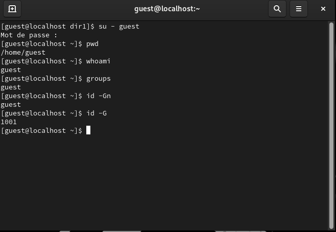

---
# Front matter
lang: ru-RU
title: "Лабораторная работа №3"
subtitle: "Дисциплина: Основы информационной безопасности"
author: "Георгес Гедеон"

# Formatting
toc-title: "Содержание"
toc: true # Table of contents
toc_depth: 2
lof: true # Список рисунков
lot: true # Список таблиц
fontsize: 12pt
linestretch: 1.5
papersize: a4paper
documentclass: scrreprt
polyglossia-lang: russian
polyglossia-otherlangs: english
mainfont: PT Serif
romanfont: PT Serif
sansfont: PT Sans
monofont: PT Mono
mainfontoptions: Ligatures=TeX
romanfontoptions: Ligatures=TeX
sansfontoptions: Ligatures=TeX,Scale=MatchLowercase
monofontoptions: Scale=MatchLowercase
indent: true
pdf-engine: lualatex
header-includes:
  - \linepenalty=10 # the penalty added to the badness of each line within a paragraph (no associated penalty node) Increasing the value makes tex try to have fewer lines in the paragraph.
  - \interlinepenalty=0 # value of the penalty (node) added after each line of a paragraph.
  - \hyphenpenalty=50 # the penalty for line breaking at an automatically inserted hyphen
  - \exhyphenpenalty=50 # the penalty for line breaking at an explicit hyphen
  - \binoppenalty=700 # the penalty for breaking a line at a binary operator
  - \relpenalty=500 # the penalty for breaking a line at a relation
  - \clubpenalty=150 # extra penalty for breaking after first line of a paragraph
  - \widowpenalty=150 # extra penalty for breaking before last line of a paragraph
  - \displaywidowpenalty=50 # extra penalty for breaking before last line before a display math
  - \brokenpenalty=100 # extra penalty for page breaking after a hyphenated line
  - \predisplaypenalty=10000 # penalty for breaking before a display
  - \postdisplaypenalty=0 # penalty for breaking after a display
  - \floatingpenalty = 20000 # penalty for splitting an insertion (can only be split footnote in standard LaTeX)
  - \raggedbottom # or \flushbottom
  - \usepackage{float} # keep figures where there are in the text
  - \floatplacement{figure}{H} # keep figures where there are in the text
---

# Цель работы

Получение практических навыков работы в консоли с атрибутами файлов для групп пользователей.

# Задание

- Сделать отчёт по лабораторной работе в формате Markdown.
- В качестве отчёта предоставить отчёты в 3 форматах: pdf, docx и md.

# Теоретическое введение

В операционной системе Linux есть много отличных функций безопасности, но одна из самых важных - это система прав доступа к файлам. Изначально каждый файл имел три параметра доступа. Вот они:

• Чтение - разрешает получать содержимое файла, но на запись нет. Для каталога позволяет получить список файлов и каталогов, расположенных в нем
• Запись - разрешает записывать новые данные в файл или изменять существующие, а также позволяет создавать и изменять файлы и каталоги
• Выполнение - невозможно выполнить программу, если у нее нет флага выполнения. Этот атрибут устанавливается для всех программ и скриптов, именно с помощью него система может понять, что этот файл нужно запускать как программу

Каждый файл имеет три категории пользователей, для которых можно устанавливать различные сочетания прав доступа:

• Владелец - набор прав для владельца файла, пользователя, который его создал или сейчас установлен его владельцем. Обычно владелец имеет все права, чтение, запись и выполнение
• Группа - любая группа пользователей, существующая в системе и привязанная к файлу. Но это может быть только одна группа и обычно это группа владельца, хотя для файла можно назначить и другую группу
• Остальные - все пользователи, кроме владельца и пользователей, входящих в группу файла

Команды, которые могут понадобиться при работе с правами доступа:

• “ls -l” - для просмотра прав доступа к файлам и каталогам
• “chmod категория действие флаг файл или каталог” - для изменения прав доступа к файлам и каталогам (категорию действие и флаг можно заменить на набор из трех цифр от 0 до 7)

Значения флагов прав:

• — - нет никаких прав
• –x - разрешено только выполнение файла, как программы, но не изменение и не чтение
• -w- - разрешена только запись и изменение файла
• -wx - разрешено изменение и выполнение, но в случае с каталогом, невозможно посмотреть его содержимое
• r– - права только на чтение
• r-x - только чтение и выполнение, без права на запись
• rw- - права на чтение и запись, но без выполнения
• rwx - все права

# Выполнение лабораторной работы
1. В установленной при выполнении предыдущей лабораторной работы ОС создаём учётную запись пользователя guest2(т.к. пользователь guest уже был создан в прошлой лабораторной работе) 
с помощью команды “sudo useradd guest2” и задаём пароль для этого пользователя командой “sudo passwd guest2”. 
Добавляем пользователя guest2 в группу guest с помощью команды “sudo gpasswd -a guest2 guest”(Рисунок 3.1).

2. Осуществил вход в систему от двух пользователей на двух разных консолях: guest на первой консоли и guest2 на второй консоли при помощи команд “su - guest” и “su - guest2”. Определил командой “pwd”,
что оба пользователя находятся в своих домашних директориях, что совпадает с приглашениями командной строки. Уточнил имена пользователей командой “whoami”, соответственно получил: guest и guest2. С помощью команд “groups guest” и “groups guest2” определил, что пользователь guest входит в группу guest, а пользователь guest2 в группы guest и guest2. Сравнил полученную информацию с выводом команд “id -Gn guest”, “id -Gn guest2”, “id -G guest” и “id -G guest2”:
данные совпали, за исключением второй команды “id -G”, которая вывела номера групп 1001 и 1002, что также является верным (рис. 4.2).

3. Просмотрел файл /etc/group командой “cat /etc/group”, данные этого файла
совпадают с полученными ранее (рис. 4.3).

4. От имени пользователя guest2 зарегистрировал этого пользователя в группе guest командой “newgrp guest”. Далее от имени пользователя guest изменил права директории /home/guest, разрешив все действия для пользователей группы командой “chmod g+rwx /home/guest”. От имени этого же пользователя снял с директории /home/guest/dir1 все атрибуты командой “chmod 000 dir1” и проверил правильность снятия атрибутов командой “ls -l” (рис. 4.4).

5. Теперь заполним таблицу «Установленные права и разрешённые действия», меняя атрибуты у директории и файла от имени пользователя guest и делая проверку от пользователя guest2.

Заполним таблицы.

В случае успеха будет записывать +, в случае ошибки доступа будем записывать -. Соберём данные в таблицу 1.

: Установленные права и разрешённые действия {табл. 1}

| Права директории | Права файла | Создание файла | Удаление файла | Запись в файл | Чтение файла | Смена директории | Просмотр файлов в директории | Переименование файла | Смена атрибутов файла |
| ---------------- | ----------- | -------------- | -------------- | ------------- | ------------ | ---------------- | ------------------- | ----------- | ------------ |
| d (000) | (000) | - | - | - | - | - | - | - | - |
| d --x (010) | (000) | - | - | - | - | + | - | - | - |
| d -w- (020) | (000) | - | - | - | - | - | - | - | - |
| d -wx (030) | (000) | + | + | - | - | + | - | + | - |
| d r-- (040) | (000) | - | - | - | - | - | + | - | - |
| d r-x (050) | (000) | - | - | - | - | + | + | - | - |
| d rw- (060) | (000) | - | - | - | - | - | + | - | - |
| d rwx (070) | (000) | + | + | - | - | + | + | + | - |
| d (000) | --x (100) | - | - | - | - | - | - | - | - |
| d --x (010) | --x (010) | - | - | - | - | + | - | - | - |
| d -w- (020) | --x (010) | - | - | - | - | - | - | - | - |
| d -wx (030) | --x (010) | + | + | - | - | + | - | + | - |
| d r-- (040) | --x (010) | - | - | - | - | - | + | - | - |
| d r-x (050) | --x (010) | - | - | - | - | + | + | - | - |
| d rw- (060) | --x (010) | - | - | - | - | - | + | - | - |
| d rwx (070) | --x (010) | + | + | - | - | + | + | + | - |
| d (000) | -w- (020) | - | - | - | - | - | - | - | - |
| d --x (010) | -w- (020) | - | - | + | - | + | - | - | - |
| d -w- (020) | -w- (020) | - | - | - | - | - | - | - | - |
| d -wx (030) | -w- (020) | + | + | + | - | + | - | + | - |
| d r-- (040) | -w- (020) | - | - | - | - | - | + | - | - |
| d r-x (050) | -w- (020) | - | - | + | - | + | + | - | - |
| d rw- (060) | -w- (020) | - | - | - | - | - | + | - | - |
| d rwx (070) | -w- (020) | + | + | + | - | + | + | + | - |
| d (000) | -wx (030) | - | - | - | - | - | - | - | - |
| d --x (010) | -wx (030) | - | - | + | - | + | - | - | - |
| d -w- (020) | -wx (030) | - | - | - | - | - | - | - | - |
| d -wx (030) | -wx (030) | + | + | + | - | + | - | + | - |
| d r-- (040) | -wx (030) | - | - | - | - | - | + | - | - |
| d r-x (050) | -wx (030) | - | - | + | - | + | + | - | - |
| d rw- (060) | -wx (030) | - | - | - | - | - | + | - | - |
| d rwx (070) | -wx (030) | + | + | + | - | + | + | + | - |
| d (000) | r-- (040) | - | - | - | - | - | - | - | - |
| d --x (010) | r-- (040) | - | - | - | + | + | - | - | - |
| d -w- (020) | r-- (040) | - | - | - | - | - | - | - | - |
| d -wx (030) | r-- (040) | + | + | - | + | + | - | + | - |
| d r-- (040) | r-- (040) | - | - | - | - | - | + | - | - |
| d r-x (050) | r-- (040) | - | - | - | + | + | + | - | - |
| d rw- (060) | r-- (040) | - | - | - | - | - | + | - | - |
| d rwx (070) | r-- (040) | + | + | - | + | + | + | + | - |
| d (000) | r-x (050) | - | - | - | - | - | - | - | - |
| d --x (010) | r-x (050) | - | - | - | + | + | - | - | - |
| d -w- (020) | r-x (050) | - | - | - | - | - | - | - | - |
| d -wx (030) | r-x (050) | + | + | - | + | + | - | + | - |
| d r-- (040) | r-x (050) | - | - | - | - | - | + | - | - |
| d r-x (050) | r-x (050) | - | - | - | + | + | + | - | - |
| d rw- (060) | r-x (050) | - | - | - | - | - | + | - | - |
| d rwx (070) | r-x (050) | + | + | - | + | + | + | + | - |
| d (000) | rw- (060) | - | - | - | - | - | - | - | - |
| d --x (010) | rw- (060) | - | - | + | + | + | - | - | - |
| d -w- (020) | rw- (060) | - | - | - | - | - | - | - | - |
| d -wx (030) | rw- (060) | + | + | + | + | + | - | + | - |
| d r-- (040) | rw- (060) | - | - | - | - | - | + | - | - |
| d r-x (050) | rw- (060) | - | - | + | + | + | + | - | - |
| d rw- (060) | rw- (060) | - | - | - | - | - | + | - | - |
| d rwx (070) | rw- (060) | + | + | + | + | + | + | + | - |
| d (000) | rwx (070) | - | - | - | - | - | - | - | - |
| d --x (010) | rwx (070) | - | - | + | + | + | - | - | - |
| d -w- (020) | rwx (070) | - | - | - | - | - | - | - | - |
| d -wx (030) | rwx (070) | + | + | + | + | + | - | + | - |
| d r-- (040) | rwx (070) | - | - | - | - | - | + | - | - |
| d r-x (050) | rwx (070) | - | - | + | + | + | + | - | - |
| d rw- (060) | rwx (070) | - | - | - | - | - | + | - | - |
| d rwx (070) | rwx (070) | + | + | + | + | + | + | + | - |

В сравнении с таблицей из Лабораторной работы №2 мы видим, что изменилась только возможность изменять атрибуты файлов. Это
связано с тем, что во всех комбинациях стоит 0 в начале, что означает отсутствие прав у владельца файла и директории. Остальные же
действия доступны как владельцу, так и членам группы, в равной степени при должной конфигурации прав.

На основании этой таблицы создадим другую, в которой опишем минимальные требования на права и директорию для выполнения тех или иных действий. Внесём проанализированные данные в таблицу 2. 

: Минимальные права для совершения операций {Таблица 2}

| Операция | Минимальные права на директорию | Минимальные права на файл |
| -------- | ------------------------------- | ------------------------- |
| Создание файла | d -wx (300) | --- (000) |
| Удаление файла | d -wx (300) | --- (000) |
| Чтение файла | d --x (100) | r-- (400) |
| Запись в файл | d --x (100) | -w- (200) |
| Переименование файла | d -wx (300) | --- (000) |
| Создание поддиректории | d -wx (300) | --- (000) |
| Удаление поддиректории | d -wx (300) | --- (000) |

# Выводы

**Вывод:** 
В ходе выполнения данной лабораторной работы я получил практические навыки работы в консоли с атрибутами файлов для групп пользователей.
