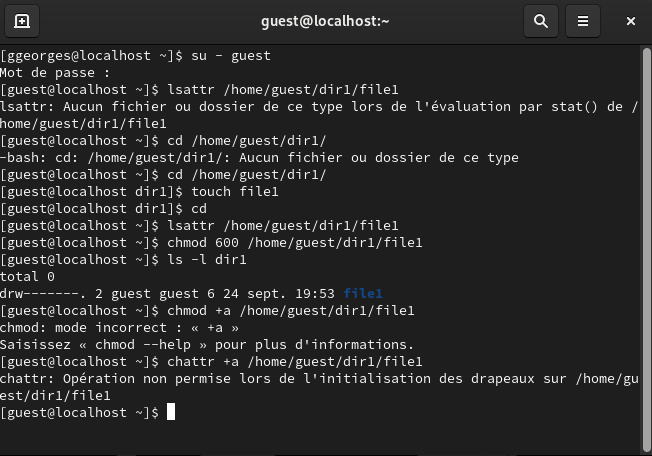
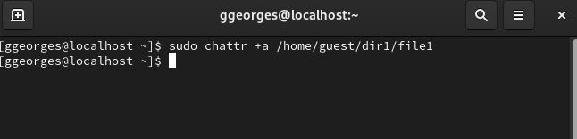
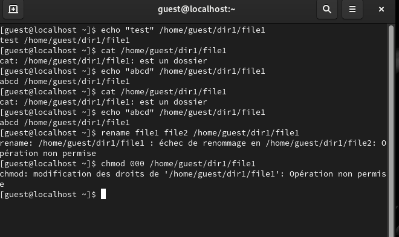
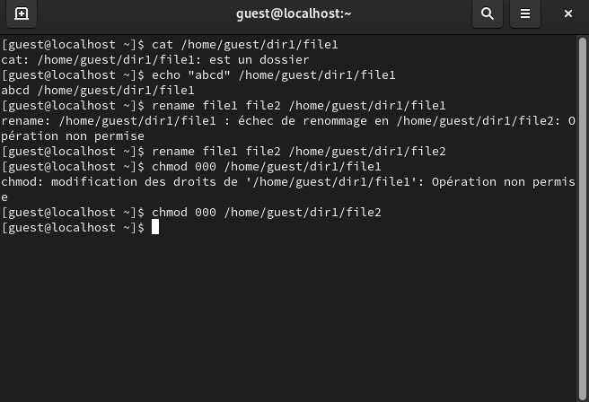
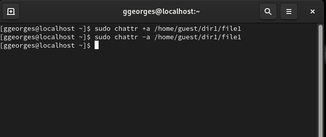
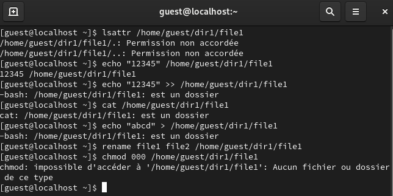
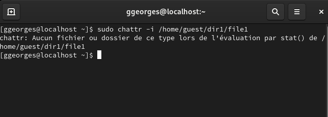

---
# Front matter
lang: ru-RU
title: "Лабораторная работа №4"
subtitle: "Дисциплина: Основы информационной безопасности"
author: "Георгес Гедеон"

# Formatting
toc-title: "Содержание"
toc: true # Table of contents
toc_depth: 2
lof: true # Список рисунков
lot: true # Список таблиц
fontsize: 12pt
linestretch: 1.5
papersize: a4paper
documentclass: scrreprt
polyglossia-lang: russian
polyglossia-otherlangs: english
mainfont: PT Serif
romanfont: PT Serif
sansfont: PT Sans
monofont: PT Mono
mainfontoptions: Ligatures=TeX
romanfontoptions: Ligatures=TeX
sansfontoptions: Ligatures=TeX,Scale=MatchLowercase
monofontoptions: Scale=MatchLowercase
indent: true
pdf-engine: lualatex
header-includes:
  - \linepenalty=10 # the penalty added to the badness of each line within a paragraph (no associated penalty node) Increasing the value makes tex try to have fewer lines in the paragraph.
  - \interlinepenalty=0 # value of the penalty (node) added after each line of a paragraph.
  - \hyphenpenalty=50 # the penalty for line breaking at an automatically inserted hyphen
  - \exhyphenpenalty=50 # the penalty for line breaking at an explicit hyphen
  - \binoppenalty=700 # the penalty for breaking a line at a binary operator
  - \relpenalty=500 # the penalty for breaking a line at a relation
  - \clubpenalty=150 # extra penalty for breaking after first line of a paragraph
  - \widowpenalty=150 # extra penalty for breaking before last line of a paragraph
  - \displaywidowpenalty=50 # extra penalty for breaking before last line before a display math
  - \brokenpenalty=100 # extra penalty for page breaking after a hyphenated line
  - \predisplaypenalty=10000 # penalty for breaking before a display
  - \postdisplaypenalty=0 # penalty for breaking after a display
  - \floatingpenalty = 20000 # penalty for splitting an insertion (can only be split footnote in standard LaTeX)
  - \raggedbottom # or \flushbottom
  - \usepackage{float} # keep figures where there are in the text
  - \floatplacement{figure}{H} # keep figures where there are in the text
---

# Цель работы

Получение практических навыков работы в консоли с расширенными атрибутами файлов.

# Теоретическое введение

В UNIX-системах, кроме стандартных прав доступа, существуют также дополнительные или специальные атрибуты файлов, которые поддерживает файловая система. Управлять атрибутами можно с помощью команды “chattr”.
Виды расширенных атрибутов:
• a - файл можно открыть только в режиме добавления для записи
• A - при доступе к файлу его запись atime не изменяется
• c - файл автоматически сжимается на диске ядром
• C - файл не подлежит обновлению «копирование при записи»
• d - файл не является кандидатом для резервного копирования при запуске
программы dump
• D - при изменении каталога изменения синхронно записываются на диск
• e - файл использует экстенты для отображения блоков на диске. Его нельзя
удалить с помощью chattr
• E - файл, каталог или символическая ссылка зашифрованы файловой системой. Этот атрибут нельзя установить или сбросить с помощью chattr, хотя
он может быть отображён с помощью lsattr
• F -директория указывает, что все поиски путей внутри этого каталога выполняются без учёта регистра. Этот атрибут можно изменить только в пустых
каталогах в файловых системах с включённой функцией casefold
• i - файл не может быть изменён: его нельзя удалить или переименовать,
нельзя создать ссылку на этот файл, большую часть метаданных файла
нельзя изменить, и файл нельзя открыть в режиме записи
• и другие
Более подробно см. в [1]

# Выполнение лабораторной работы

1)От имени пользователя guest определяем расширенные атрибуты файла /home/guest/dir1/file1 командой “lsattr /home/guest/dir1/file1”. 
Командой “chmod 600 /home/guest/dir1/file1” устанавливаем права, разрешающие чтение и запись для владельца файла. 
При попытке использовать команду “chattr +a /home/guest/dir1/file1” для установления расширенного атрибута “a” получаем отказ в выполнении операции(Рисунок 3.1).

2)От имени суперпользователя устанавливаем расширенный атрибут “a” на файл командой “sudo chattr +a /home/guest/dir1/file1” и от имени пользователя guest проверяем правильность установления атрибута командой “lsattr /home/guest/dir1/file1”(Рисунок 3.2).

{ width=70% }

3)Дозаписываем в файл file1 слово “test” командой “echo”test” » /home/guest/dir1/file1” и, используя команду “cat /home/guest/dir1/file1” убеждаемся, что указанное ранее слово было успешно записано в наш файл. 
Аналогично записываем в файл слово “abcd”. 
Далее пробуем стереть имеющуюся в файле информацию командой “echo” abcd” > /home/guest/dirl/file1”, но получаем отказ. 
Пробуем переименовать файл командой “rename file1 file2 /home/guest/dirl/file1” и изменить права доступа командой “chmod 000 /home/guest/dirl/file1” и также получаем отказ(Рисунок 3.3).

{ width=70% }

4)Снимаем расширенный атрибут “a” с файла от имени суперпользователя командой “sudo chattr -a /home/guest/dir1/file1” и повторяем операции, которые ранее не получилось выполнить - теперь ошибок не было, операции были выполнены(Рисунок 3.4).

5)От имени суперпользователя командой “sudo chattr +i /home/guest/dir1/file1” установливаем расширенный атрибут “i” и повторяем действия, которые выполняли ранее. 
В данном случае файл можно было только прочитать, а изменить/записать в него что-то, переименовать и изменить его атрибуты - нельзя(Рисунок 3.5).

# Выводы

- В ходе выполнения данной лабораторной работы я получил практические навыки работы в консоли с расширенными атрибутами файлов, на практике опробовал действие расширенных атрибутов “a” и “i”.

