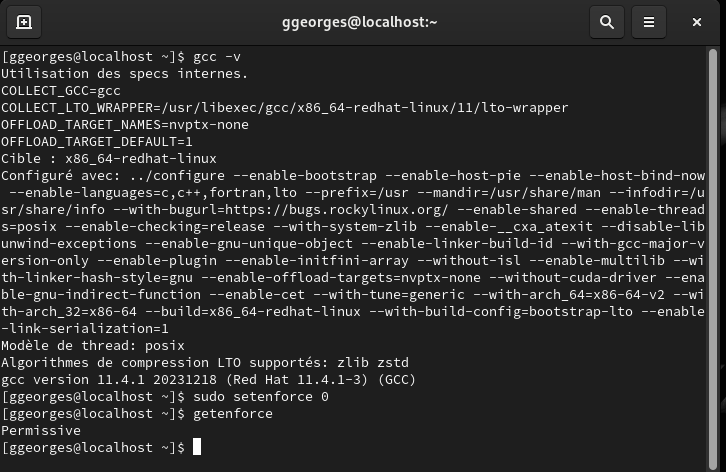
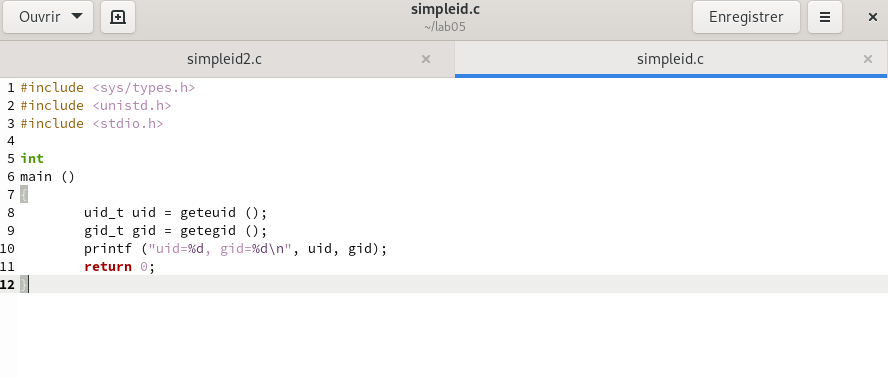
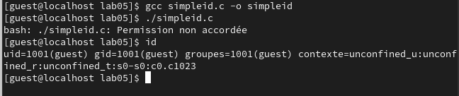
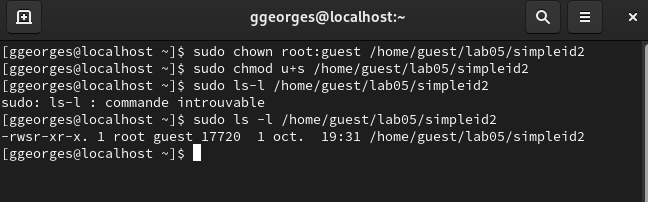
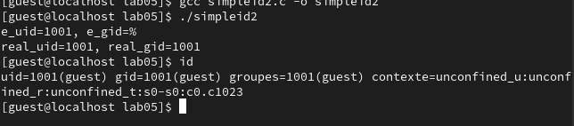
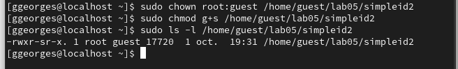
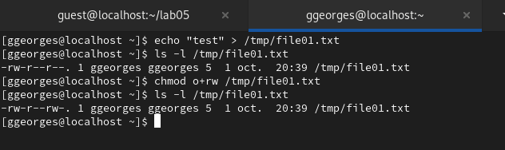
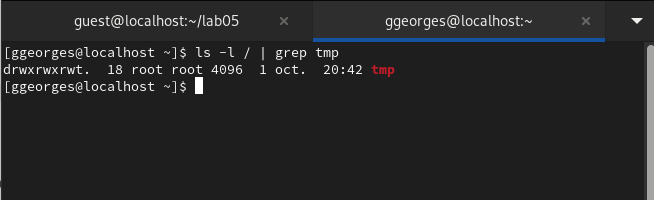
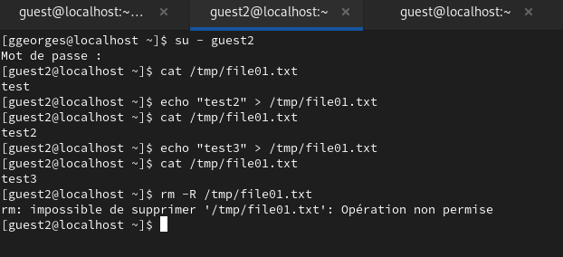
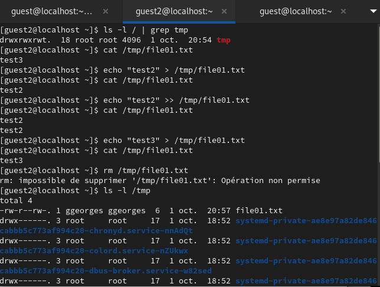

---
## Front matter
lang: ru-RU
title: Отчёт по лабораторной работе №5
author: Георгес Гедеон
institute: РУДН, Москва, Россия

date: 05 Октября 2024

## Formatting
toc: false
slide_level: 2
theme: metropolis
header-includes: 
 - \metroset{progressbar=frametitle,sectionpage=progressbar,numbering=fraction}
 - '\makeatletter'
 - '\beamer@ignorenonframefalse'
 - '\makeatother'
aspectratio: 43
section-titles: true
---

# Отчет по лабораторной работе №5

##

Цель работы: Изучение механизмов изменения идентификаторов, применения SetUID- и Sticky-битов. Получение практических навыков работы в консоли с дополнительными атрибутами. Рассмотрение работы механизма смены идентификатора процессов пользователей, а также влияние бита Sticky на запись и удаление файлов.

## 

Теоретическое введение

SetUID, SetGID и Sticky - это специальные типы разрешений позволяют задавать расширенные права доступа на файлы или каталоги. 
• SetUID (set user ID upon execution — «установка ID пользователя во время выполнения) являются флагами прав доступа в Unix, которые разрешают пользователям запускать исполняемые файлы с правами владельца исполняемого файла.
• SetGID (set group ID upon execution — «установка ID группы во время выполнения») являются флагами прав доступа в Unix, которые разрешают пользователям запускать исполняемые файлы с правами группы исполняемого файла.
• Sticky bit в основном используется в общих каталогах, таких как /var или /tmp, поскольку пользователи могут создавать файлы, читать и выполнять их, принадлежащие другим пользователям, но не могут удалять файлы, принадлежащие другим пользователям.

##

1 часть: Создание программы

Для начала мы убеждаемся, что компилятор gcc установлен, исолпьзуя команду “gcc -v”. 
Затем отключаем систему запретов до очередной перезагрузки системы командой “sudo setenforce 0”, после чего команда “getenforce” выводит “Permissive”.

{ width=70% }

##

Код программы выглядит следующим образом.

{ width=70% }

##

Скомпилируем программу и убедимся, что файл программы был создан командой “gcc simpleid.c -o simpleid”.
Выполняем программу simpleid командой “./simpleid”, а затем системную программу id командой “id”.
Результаты, полученные в результате выполнения обеих команд, совпадают(uid=1001 и gid=1001).

{ width=70% }

##

От имени суперпользователя выполняем команды “sudo chown root:guest /home/guest/lab05/simpleid2” и “sudo chmod u+s /home/guest/lab05/simpleid2”, затем выполняем проверку правильности установки новых атрибутов и смены владельца файла simpleid2 командой “sudo ls -l /home/guest/lab05/simpleid2”(Рисунок 3.8). 
Этими командами была произведена смена пользователя файла на root и установлен SetUID-бит.

{ width=70% }

##

Запускаем программы simpleid2 и id. Теперь появились различия в uid.

{ width=70% }

##

Проделаем тоже самое относительно SetGID-бита. Также можем заметить различия с предыдущим пунктом.

{ width=70% }

##

2 часть: Исследование Sticky-бита

Командой “ls -l / | grep tmp” убеждаемся, что атрибут Sticky на директории /tmp установлен. 
От имени пользователя guest создаём файл file01.txt в директории /tmp со словом test командой “echo”test” > /tmp/file01.txt”. 
Просматриваем атрибуты у только что созданного файла и разрешаем чтение и запись для категории пользователей “все остальные” командами “ls -l /tmp/file01.txt” и “chmod o+rw /tmp/file01.txt”.

{ width=70% }

##

От имени пользователя guest2 пробуем прочитать файл командой “cat /tmp/file01.txt” - это удалось. 
Далее пытаемся дозаписать в файл слово test2, проверить содержимое файла и записать в файл слово test3, стерев при этом всю имеющуюся в файле информацию - эти операции удалось выполнить только в случае, если еще дополнительно разрешить чтение и запись для группы пользователей командой “chmod g+rw /tmp/file01.txt”. 
От имени пользователя guest2 пробуем удалить файл - это не удается ни в каком из случаев, возникает ошибка.

{ width=70% }

##

Повышаем права до суперпользователя командой “su -” и выполняем команду, снимающую атрибут t с директории /tmp “chmod -t /tmp”. 
После чего покидаем режим суперпользователя командой “exit”. 
Повторяем предыдущие шаги. 
Теперь нам удаётся удалить файл file01.txt от имени пользователя, не являющегося его владельцем.

{ width=70% }

## Выводы

- В ходе выполнения данной лабораторной работы я изучил механизмы изменения идентификаторов, применение SetUID- и Sticky-битов. Получил практические навыки работы в консоли с дополнительными атрибутами. Рассмотрел работу механизма смены идентификатора процессов пользователей, а также влияние бита Sticky на запись и удаление файлов.
