---
## Front matter
lang: ru-RU
title: Отчёт по лабораторной работе №6
author: Георгес Гедеон
institute: РУДН, Москва, Россия

date: 12 Октября 2024

## Formatting
toc: false
slide_level: 2
theme: metropolis
header-includes: 
 - \metroset{progressbar=frametitle,sectionpage=progressbar,numbering=fraction}
 - '\makeatletter'
 - '\beamer@ignorenonframefalse'
 - '\makeatother'
aspectratio: 43
section-titles: true
---

# Отчет по лабораторной работе №6

##

Цель работы: Развить навыки администрирования ОС Linux. Получить первое практическое знакомство с технологией SELinux. Проверить работу SELinux на практике совместно с веб-сервером Apache.

## 

Теоретическое введение

SELinux (Security-Enhanced Linux) обеспечивает усиление защиты путем внесения изменений как на уровне ядра, так и на уровне пространства пользователя, что превращает ее в действительно «непробиваемую» операционную систему.
Впервые эта система появилась в четвертой версии CentOS, а в 5 и 6 версии реализация была существенно дополнена и улучшена.
SELinux имеет три основных режим работы:
• Enforcing: Режим по-умолчанию. При выборе этого режима все действия, которые каким-то образом нарушают текущую политику безопасности, будут блокироваться, а попытка нарушения будет зафиксирована в журнале.
• Permissive: В случае использования этого режима, информация о всех действиях, которые нарушают текущую политику безопасности, будут зафиксированы в журнале, но сами действия не будут заблокированы.
• Disabled: Полное отключение системы принудительного контроля доступа.
Политика SELinux определяет доступ пользователей к ролям, доступ ролей к доменам и доступ доменов к типам.
Контекст безопасности — все атрибуты SELinux — роли, типы и домены.
Более подробно см. в [1].

##

Входим в систему под своей учетной записью и убеждаемся, что SELinux работает в режиме enforcing политики targeted с помощью команд “getenforce” и “sestatus”.

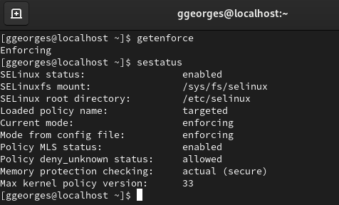{ width=70% }

##

Обращаемся с помощью браузера к веб-серверу, запущенному на моем компьютере, и убеждаемся, что последний работает с помощью команды “service httpd status”.

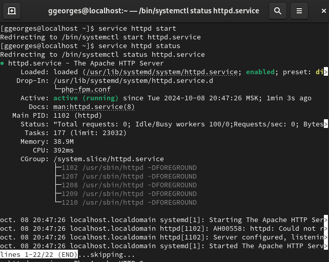{ width=70% }

##

С помощью команды “ps auxZ | grep httpd” определяем контекст безопасности веб-сервера Apache - httpd_t.

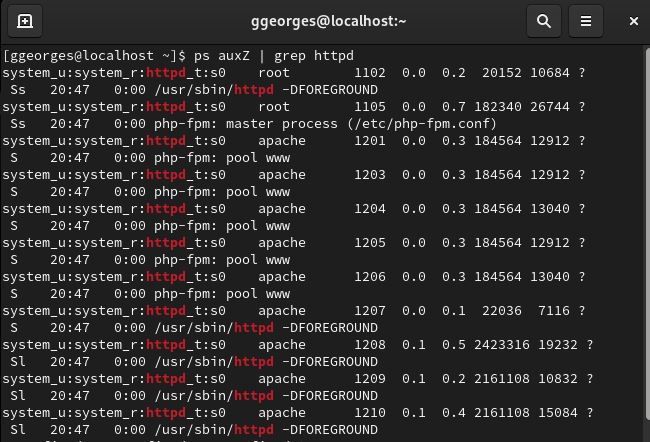{ width=70% }

##

С помощью команды “ls -lZ /var/www” посмотрим файлы и поддиректории, находящиеся в директории /var/www. 
Используя команду “ls -lZ /var/www/html”, определяем, что в данной директории файлов нет. 
Только владелец или суперпользователь может создавать файлы в директории /var/www/html.

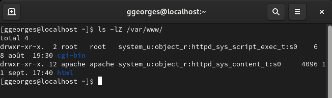{ width=70% }

##

От имени суперпользователя создаём html-файл /var/www/html/test.html. 
Контекст созданного файла - httpd_sys_content_t.

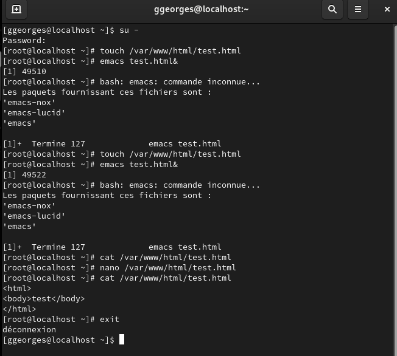{ width=70% }

##

Обращаемся к файлу через веб-сервер, введя в браузере адрес “http://127.0.0.1/test.html”.
Файл был успешно отображен.

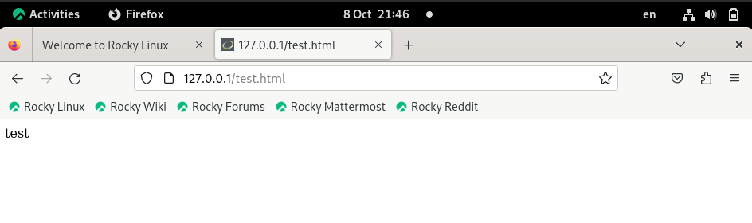{ width=70% }

##

Изучив справку man httpd_selinux, выясняем, что для httpd определены следующие контексты файлов: httpd_sys_content_t, httpd_sys_script_exec_t,
httpd_sys_script_ro_t, httpd_sys_script_rw_t, httpd_sys_script_ra_t, httpd_unconfined_script_exec_t.
Контекст моего файла - httpd_sys_content_t (в таком случае содержимое должно быть доступно для всех скриптов httpd и для самого демона). 
Изменяем контекст файла на samba_share_t командой “sudo chcon -t samba_share_t /var/www/html/test.html” и проверяем, что контекст поменялся.

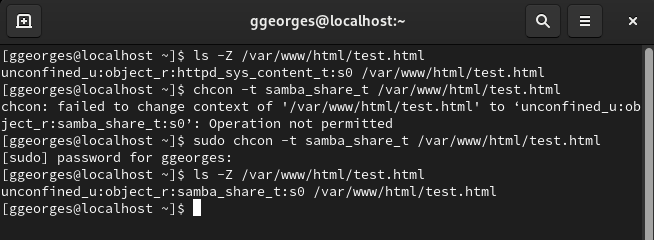{ width=70% }

##

Попробуем еще раз получить доступ к файлу через веб-сервер, введя в браузере адрес “http://127.0.0.1/test.html” и получаем сообщение об ошибке(т.к. к установленному ранее контексту процесс httpd не имеет доступа).

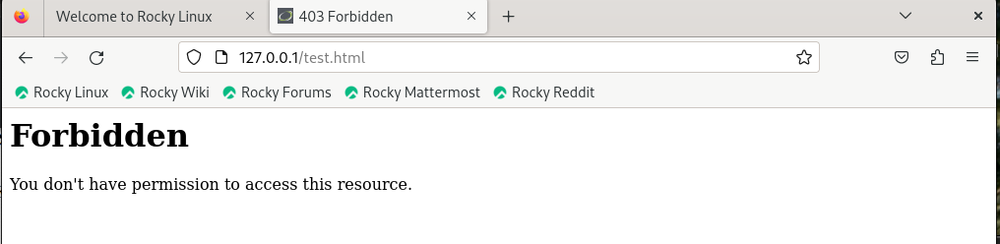{ width=70% }

##

В файле /etc/httpd/conf/httpd.conf заменяем строчку “Listen 80” на “Listen 81”, чтобы установить веб-сервер Apache на прослушивание TCP-порта 81.

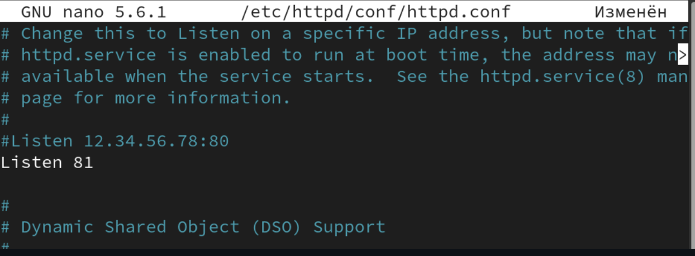{ width=70% }

##

Выполняем команду “semanage port -a -t http_port_t -р tcp 81” и убеждаемся, что порт TCP-81 установлен. 
Проверяем список портов командой “semanage port -l | grep http_port_t”, убеждаемся, что порт 81 есть в списке и запускаем веб-сервер Apache снова.

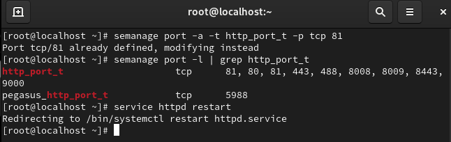{ width=70% }

##

Вернём контекст “httpd_sys_cоntent_t” файлу “/var/www/html/test.html” командой “chcon -t httpd_sys_content_t /var/www/html/test.html"
и после этого пробуем получить доступ к файлу через веб-сервер, введя адрес
“http://127.0.0.1:81/test.html”, в результате чего увидим содежимое файла - слово “test”.

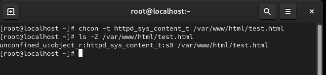{ width=70% }

## Выводы

- В ходе выполнения данной лабораторной работы я развил навыки администрирования ОС Linux, получил первое практическое знакомство с технологией SELinux и проверил работу SELinux на практике совместно с веб-сервером Apache.
