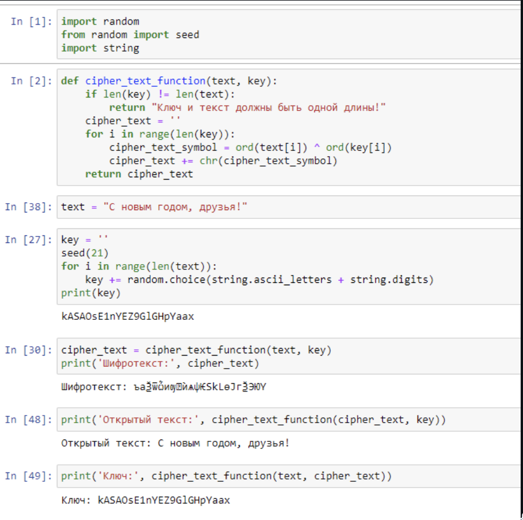

---
## Front matter
lang: ru-RU
title: Отчёт по лабораторной работе №7
author: Георгес Гедеон
institute: РУДН, Москва, Россия

date: 19 Октября 2024

## Formatting
toc: false
slide_level: 2
theme: metropolis
header-includes: 
 - \metroset{progressbar=frametitle,sectionpage=progressbar,numbering=fraction}
 - '\makeatletter'
 - '\beamer@ignorenonframefalse'
 - '\makeatother'
aspectratio: 43
section-titles: true
---

# Отчет по лабораторной работе №7

##

Цель работы: Освоить на практике применение режима однократного гаммирования.

## 

Теоретическое введение

Гаммирование - наложение (снятие) на открытые (зашифрованные) данные
последовательности элементов других данных, полученной с помощью некоторого криптографического алгоритма, для получения зашифрованных (открытых)
данных.
Основная формула, необходимая для реализации однократного гаммирования:
Ci = Pi XOR Ki, где Ci - i-й символ зашифрованного текста, Pi - i-й символ открытого
текста, Ki - i-й символ ключа.
Аналогичным образом можно найти ключ: Ki = Ci XOR Pi.
Необходимые и достаточные условия абсолютной стойкости шифра:
• длина открытого текста равна длине ключа
• ключ должен использоваться однократно
• ключ должен быть полностью случаен

Более подробно см. в [1].

##

Код программы.

{ width=70% }

## Выводы

- В ходе выполнения данной лабораторной работы я освоил на практике применение режима однократного гаммирования.
