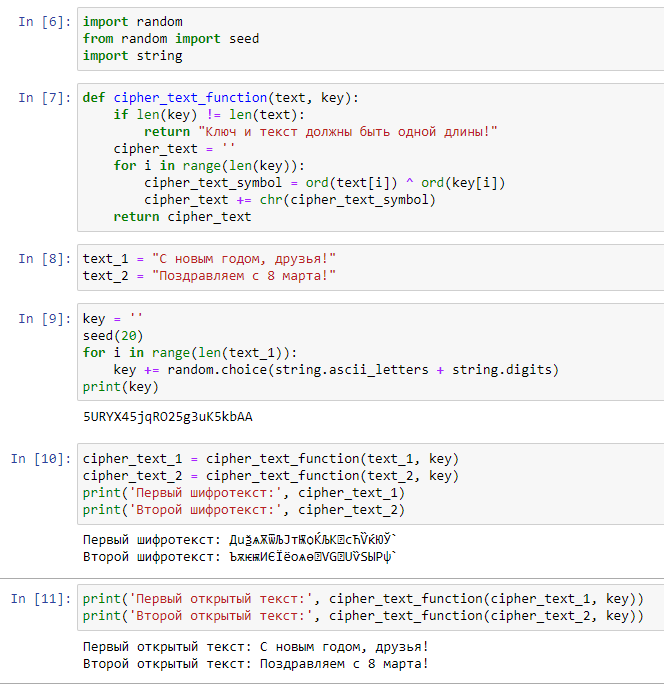

---
## Front matter
lang: ru-RU
title: Отчёт по лабораторной работе №8
author: Георгес Гедеон
institute: РУДН, Москва, Россия

date: 26 Октября 2024

## Formatting
toc: false
slide_level: 2
theme: metropolis
header-includes: 
 - \metroset{progressbar=frametitle,sectionpage=progressbar,numbering=fraction}
 - '\makeatletter'
 - '\beamer@ignorenonframefalse'
 - '\makeatother'
aspectratio: 43
section-titles: true
---

# Отчет по лабораторной работе №7

##

Цель работы: Освоить на практике применение режима однократного гаммирования на примере кодирования различных исходных текстов одним ключом.

## 

Теоретическое введение

Гаммирование - наложение (снятие) на открытые (зашифрованные) данные
последовательности элементов других данных, полученной с помощью некоторого криптографического алгоритма, для получения зашифрованных (открытых)
данных.
Основная формула, необходимая для реализации однократного гаммирования:
Ci = Pi XOR Ki, где Ci - i-й символ зашифрованного текста, Pi - i-й символ открытого
текста, Ki - i-й символ ключа.
Аналогичным образом можно найти ключ: Ki = Ci XOR Pi.
Необходимые и достаточные условия абсолютной стойкости шифра:
• длина открытого текста равна длине ключа
• ключ должен использоваться однократно
• ключ должен быть полностью случаен

Более подробно см. в [1].

## Код программы(Рисунок 3.1).

{ width=70% }

{ width=70% }

##

• In[1]: импорт необходимых библиотек
• In[2]: функция, реализующая сложение по модулю два двух строк
• In[3]: открытые/исходные тексты (одинаковой длины)
• In[5]: создание ключа той же длины, что и открытые тексты
• In[7]: получение шифротекстов с помощью функции, созданной ранее, при
условии, что известны открытые тексты и ключ
• In[8]: получение открытых текстов с помощью функции, созданной ранее,
при условии, что известны шифротексты и ключ
• In[9]: сложение по модулю два двух шифротекстов с помощию функции,
созданной ранее
• In[10]: получение открытых текстов с помощью функции, созданной ранее,
при условии, что известны оба шифротекста и один из открытых текстов
• In[12]: получение части первого открытого текста (срез)
• In[14]: получение части второго текста (на тех позициях, на которых расположены символы части первого открытого текста) с помощью функции,
созданной ранее, при условии, что известны оба шифротекста и часть первого открытого текста

## Выводы

- В ходе выполнения данной лабораторной работы я освоил на практике применение режима однократного гаммирования на примере кодирования различных исходных текстов одним ключом.
