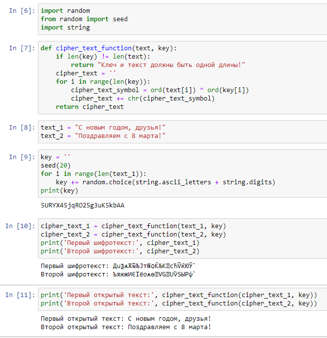
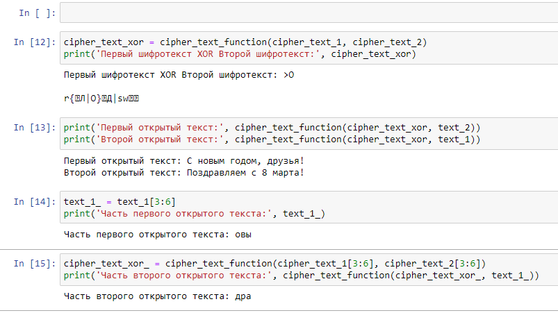

---
# Front matter
lang: ru-RU
title: "Лабораторная работа №8"
subtitle: "Дисциплина: Основы информационной безопасности"
author: "Георгес Гедеон"

# Formatting
toc-title: "Содержание"
toc: true # Table of contents
toc_depth: 2
lof: true # Список рисунков
lot: true # Список таблиц
fontsize: 12pt
linestretch: 1.5
papersize: a4paper
documentclass: scrreprt
polyglossia-lang: russian
polyglossia-otherlangs: english
mainfont: PT Serif
romanfont: PT Serif
sansfont: PT Sans
monofont: PT Mono
mainfontoptions: Ligatures=TeX
romanfontoptions: Ligatures=TeX
sansfontoptions: Ligatures=TeX,Scale=MatchLowercase
monofontoptions: Scale=MatchLowercase
indent: true
pdf-engine: lualatex
header-includes:
  - \linepenalty=10 # the penalty added to the badness of each line within a paragraph (no associated penalty node) Increasing the value makes tex try to have fewer lines in the paragraph.
  - \interlinepenalty=0 # value of the penalty (node) added after each line of a paragraph.
  - \hyphenpenalty=50 # the penalty for line breaking at an automatically inserted hyphen
  - \exhyphenpenalty=50 # the penalty for line breaking at an explicit hyphen
  - \binoppenalty=700 # the penalty for breaking a line at a binary operator
  - \relpenalty=500 # the penalty for breaking a line at a relation
  - \clubpenalty=150 # extra penalty for breaking after first line of a paragraph
  - \widowpenalty=150 # extra penalty for breaking before last line of a paragraph
  - \displaywidowpenalty=50 # extra penalty for breaking before last line before a display math
  - \brokenpenalty=100 # extra penalty for page breaking after a hyphenated line
  - \predisplaypenalty=10000 # penalty for breaking before a display
  - \postdisplaypenalty=0 # penalty for breaking after a display
  - \floatingpenalty = 20000 # penalty for splitting an insertion (can only be split footnote in standard LaTeX)
  - \raggedbottom # or \flushbottom
  - \usepackage{float} # keep figures where there are in the text
  - \floatplacement{figure}{H} # keep figures where there are in the text
---

# Цель работы

Освоить на практике применение режима однократного гаммирования на примере кодирования различных исходных текстов одним ключом.

# Теоретическое введение

Гаммирование - наложение (снятие) на открытые (зашифрованные) данные
последовательности элементов других данных, полученной с помощью некоторого криптографического алгоритма, для получения зашифрованных (открытых)
данных.
Основная формула, необходимая для реализации однократного гаммирования:
Ci = Pi XOR Ki, где Ci - i-й символ зашифрованного текста, Pi - i-й символ открытого
текста, Ki - i-й символ ключа.
Аналогичным образом можно найти ключ: Ki = Ci XOR Pi.
Необходимые и достаточные условия абсолютной стойкости шифра:
• длина открытого текста равна длине ключа
• ключ должен использоваться однократно
• ключ должен быть полностью случаен

Более подробно см. в [1].

# Выполнение лабораторной работы

1)Код программы(Рисунок 3.1).

{ width=70% }

• In[1]: импорт необходимых библиотек
• In[2]: функция, реализующая сложение по модулю два двух строк
• In[3]: открытые/исходные тексты (одинаковой длины)
• In[5]: создание ключа той же длины, что и открытые тексты
• In[7]: получение шифротекстов с помощью функции, созданной ранее, при
условии, что известны открытые тексты и ключ
• In[8]: получение открытых текстов с помощью функции, созданной ранее,
при условии, что известны шифротексты и ключ

{ width=70% }

• In[9]: сложение по модулю два двух шифротекстов с помощию функции,
созданной ранее
• In[10]: получение открытых текстов с помощью функции, созданной ранее,
при условии, что известны оба шифротекста и один из открытых текстов
• In[12]: получение части первого открытого текста (срез)
• In[14]: получение части второго текста (на тех позициях, на которых расположены символы части первого открытого текста) с помощью функции,
созданной ранее, при условии, что известны оба шифротекста и часть первого открытого текста

# Выводы

- В ходе выполнения данной лабораторной работы я освоил на практике применение режима однократного гаммирования на примере кодирования различных исходных текстов одним ключом.
