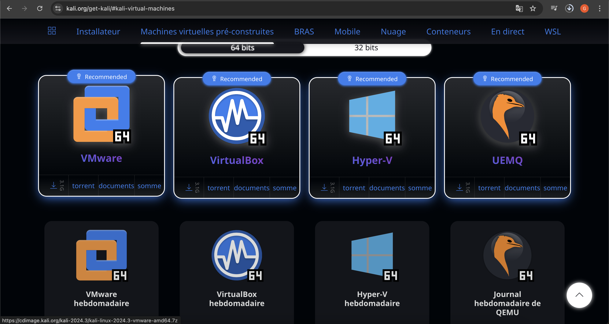
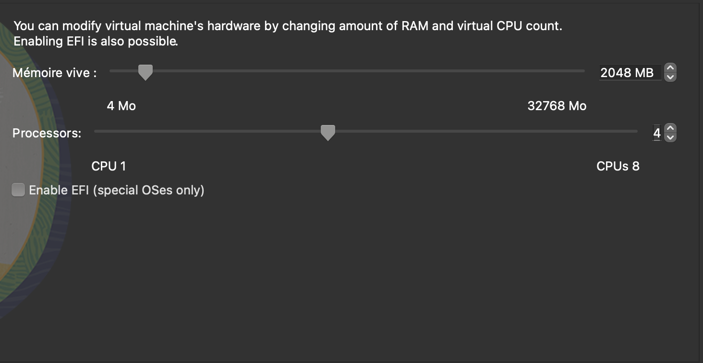
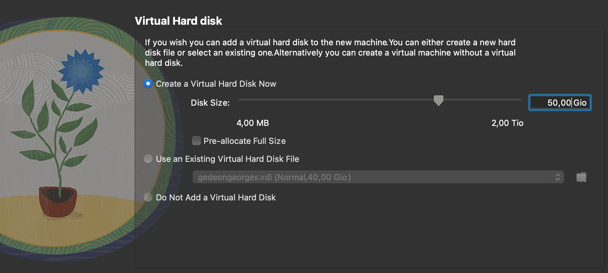
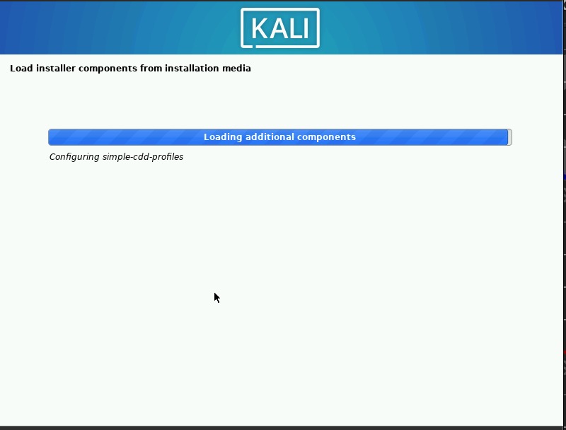
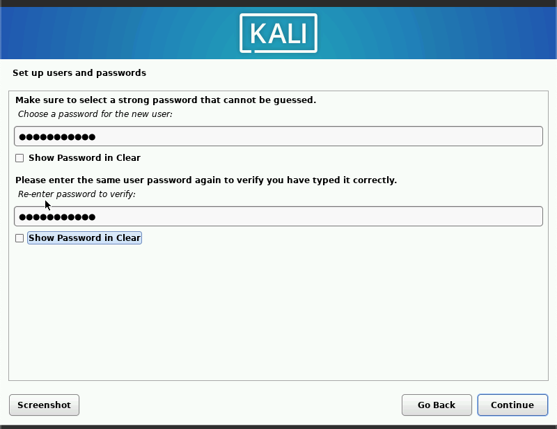
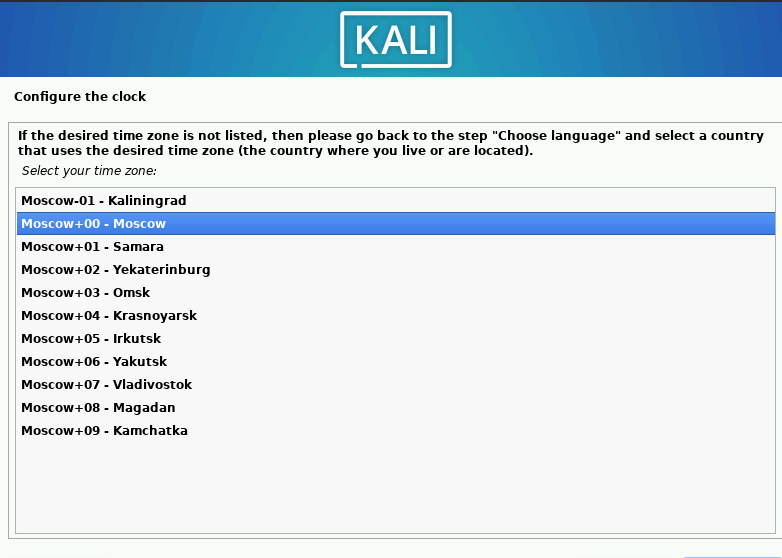

---
## Front matter
lang: ru-RU
title: personal presentation№2
author: Георгес Гедеон
institute: РУДН, Москва, Россия

date: 14 Сентября 2024

## Formatting
toc: false
slide_level: 2
theme: metropolis
header-includes: 
 - \metroset{progressbar=frametitle,sectionpage=progressbar,numbering=fraction}
 - '\makeatletter'
 - '\beamer@ignorenonframefalse'
 - '\makeatother'
aspectratio: 43
section-titles: true
---

# Отчет по лабораторной работе №2

## Создание нового пользователя

## Вход

## Проверка 

## Просмотр прав

## Удаление прав

## Итог удаления

## Первая таблица

## Вторая таблица

## Выводы

- Я приобрел практические навыки работы с файлами, связанными с консолью, и на базе Kali Linux,закрепил теоретические основы дискреционного контроля доступа в современных системах с открытым исходным кодом.
