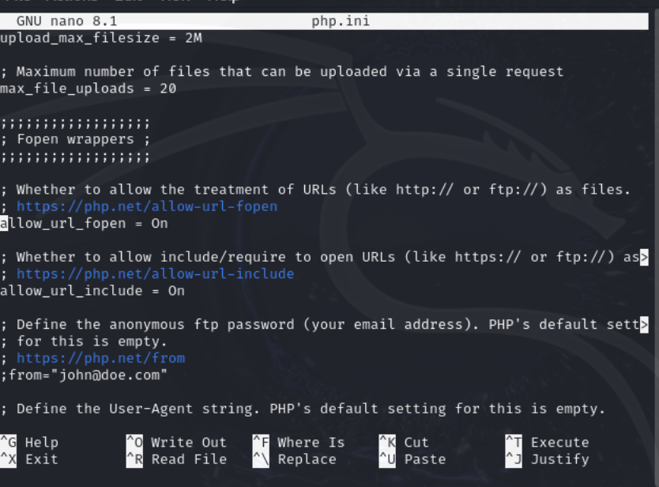
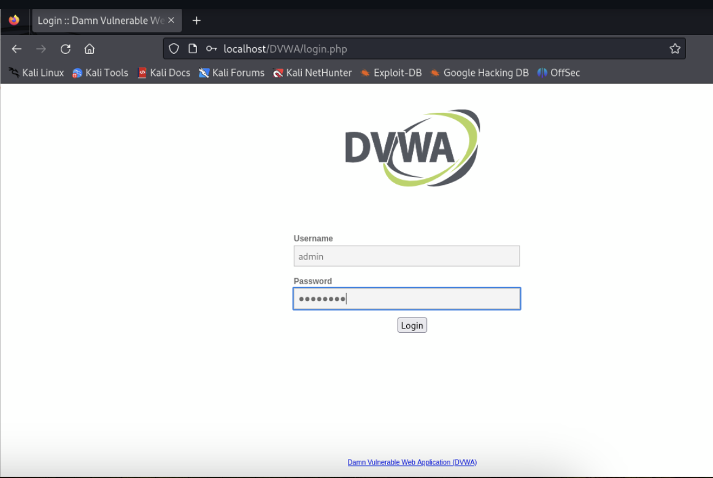

---
## Front matter
lang: ru-RU
title: personal presentation№2
author: Георгес Гедеон
institute: РУДН, Москва, Россия

date: 21 Сентября 2024

## Formatting
toc: false
slide_level: 2
theme: metropolis
header-includes: 
 - \metroset{progressbar=frametitle,sectionpage=progressbar,numbering=fraction}
 - '\makeatletter'
 - '\beamer@ignorenonframefalse'
 - '\makeatother'
aspectratio: 43
section-titles: true
---

## Вывод
Я приобрел практический навык установки и развертывания веб-приложений DVWA в гостевую систему к Kali Linux.