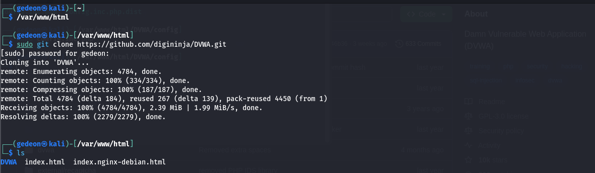
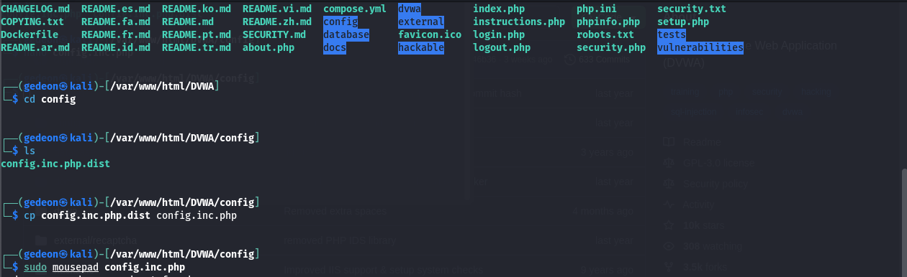
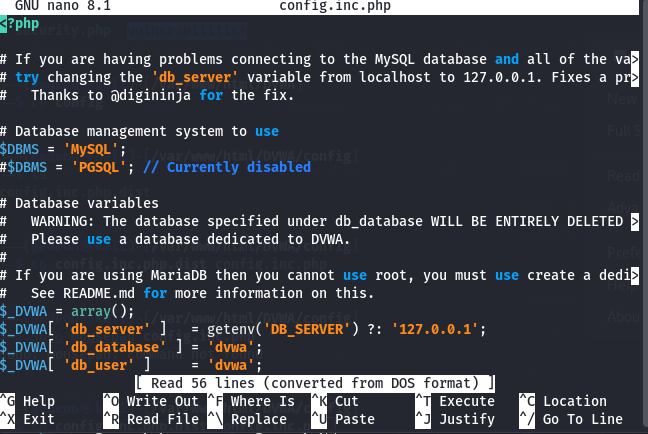
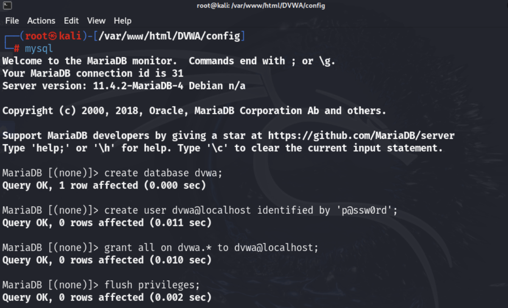
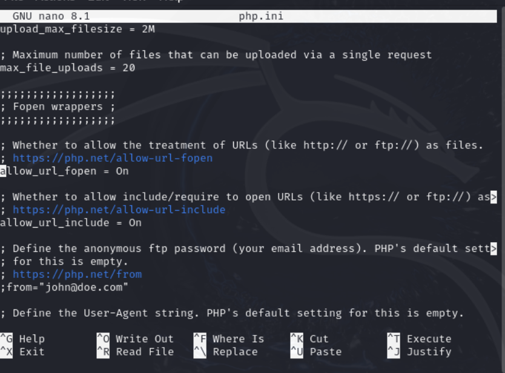
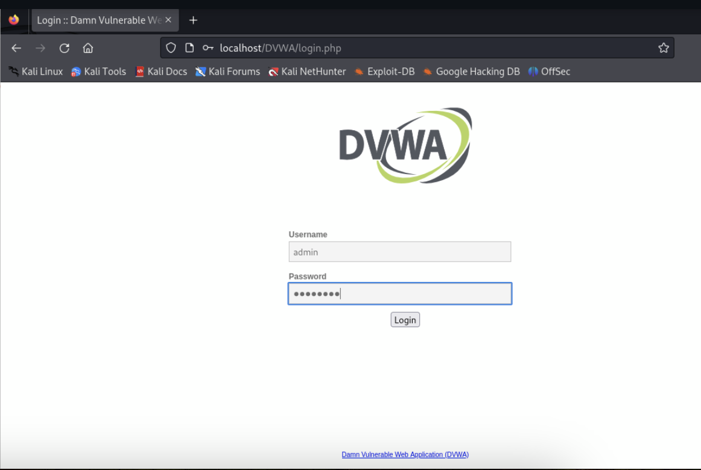
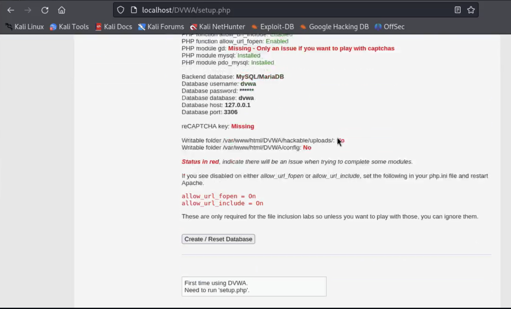
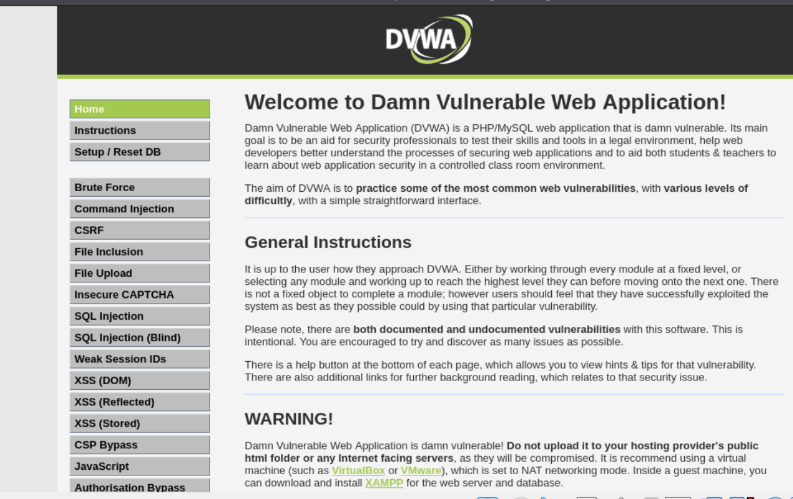

---
# Front matter
lang: ru-RU
title: "personal project#2"
subtitle: "Дисциплина: Основы информационной безопасности"
author: "Георгес Гедеон"

# Formatting
toc-title: "Содержание"
toc: true # Table of contents
toc_depth: 2
lof: true # Список рисунков
lot: true # Список таблиц
fontsize: 12pt
linestretch: 1.5
papersize: a4paper
documentclass: scrreprt
polyglossia-lang: russian
polyglossia-otherlangs: english
mainfont: PT Serif
romanfont: PT Serif
sansfont: PT Sans
monofont: PT Mono
mainfontoptions: Ligatures=TeX
romanfontoptions: Ligatures=TeX
sansfontoptions: Ligatures=TeX,Scale=MatchLowercase
monofontoptions: Scale=MatchLowercase
indent: true
pdf-engine: lualatex
header-includes:
  - \linepenalty=10 # the penalty added to the badness of each line within a paragraph (no associated penalty node) Increasing the value makes tex try to have fewer lines in the paragraph.
  - \interlinepenalty=0 # value of the penalty (node) added after each line of a paragraph.
  - \hyphenpenalty=50 # the penalty for line breaking at an automatically inserted hyphen
  - \exhyphenpenalty=50 # the penalty for line breaking at an explicit hyphen
  - \binoppenalty=700 # the penalty for breaking a line at a binary operator
  - \relpenalty=500 # the penalty for breaking a line at a relation
  - \clubpenalty=150 # extra penalty for breaking after first line of a paragraph
  - \widowpenalty=150 # extra penalty for breaking before last line of a paragraph
  - \displaywidowpenalty=50 # extra penalty for breaking before last line before a display math
  - \brokenpenalty=100 # extra penalty for page breaking after a hyphenated line
  - \predisplaypenalty=10000 # penalty for breaking before a display
  - \postdisplaypenalty=0 # penalty for breaking after a display
  - \floatingpenalty = 20000 # penalty for splitting an insertion (can only be split footnote in standard LaTeX)
  - \raggedbottom # or \flushbottom
  - \usepackage{float} # keep figures where there are in the text
  - \floatplacement{figure}{H} # keep figures where there are in the text
---

## **Цель работы**

Приобретение практического навыка установки и развертывания веб-приложений DVWA в гостевую систему к Kali Linux.

## **Выполнение работы**

Перейдем в директорию /var/www/html/ и склонируем репозиторий командой: "git clone https://github.com/digininja/DVWA.git"

Перейдем в директорию config и скопируем содержимое файла config.inc.php.dist в файл config.inc.php командой: "cp config.inc.php.dist config.inc.php":

Откроем файл с помощью команды: "nano config.inc.php"

Теперь перейдем к созданию базы данных и пользователя в соответствии с файлом config.inc.php:

 

Для корректной работы переменные allow_url_include и allow_url_fopen должны иметь значения On.

Теперь перейдем по адресу https://127.0.0.1/DVWA/login.php.

В форму авторизации введем имя пользователя-admin и пароль-password.

Перейдя на страницу приложения, прокрутим ее вниз до кнопки "Create / Reset Database" и нажмем на нее. После авторизуемся повторно: 

Веб-приложение DVWA установлено.

## Вывод
Я приобрел практический навык установки и развертывания веб-приложений DVWA в гостевую систему к Kali Linux.