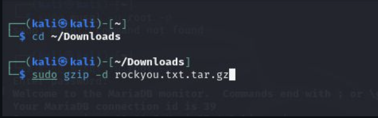
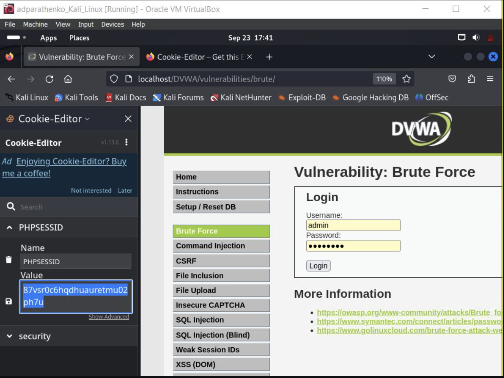
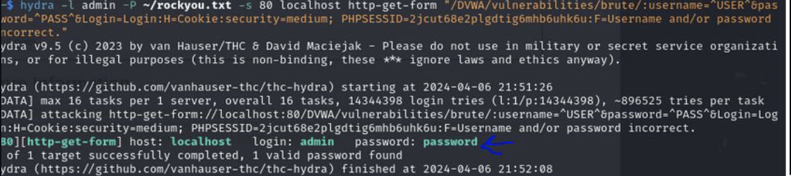
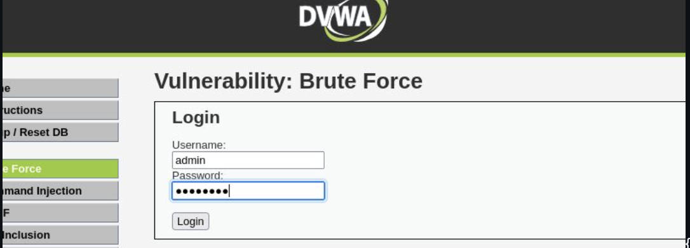
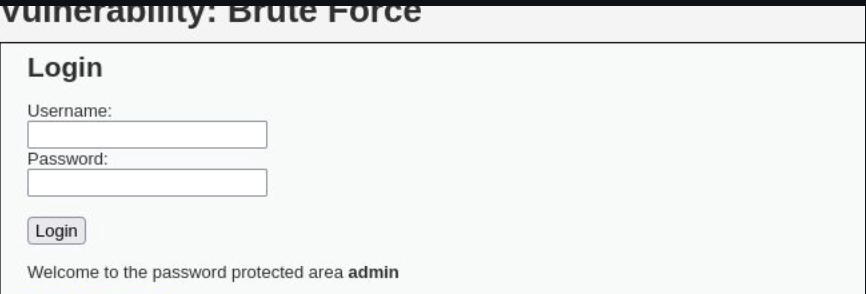

---
# Front matter
lang: ru-RU
title: "personal project#3"
subtitle: "Дисциплина: Основы информационной безопасности"
author: "Георгес Гедеон"

# Formatting
toc-title: "Содержание"
toc: true # Table of contents
toc_depth: 2
lof: true # Список рисунков
lot: true # Список таблиц
fontsize: 12pt
linestretch: 1.5
papersize: a4paper
documentclass: scrreprt
polyglossia-lang: russian
polyglossia-otherlangs: english
mainfont: PT Serif
romanfont: PT Serif
sansfont: PT Sans
monofont: PT Mono
mainfontoptions: Ligatures=TeX
romanfontoptions: Ligatures=TeX
sansfontoptions: Ligatures=TeX,Scale=MatchLowercase
monofontoptions: Scale=MatchLowercase
indent: true
pdf-engine: lualatex
header-includes:
  - \linepenalty=10 # the penalty added to the badness of each line within a paragraph (no associated penalty node) Increasing the value makes tex try to have fewer lines in the paragraph.
  - \interlinepenalty=0 # value of the penalty (node) added after each line of a paragraph.
  - \hyphenpenalty=50 # the penalty for line breaking at an automatically inserted hyphen
  - \exhyphenpenalty=50 # the penalty for line breaking at an explicit hyphen
  - \binoppenalty=700 # the penalty for breaking a line at a binary operator
  - \relpenalty=500 # the penalty for breaking a line at a relation
  - \clubpenalty=150 # extra penalty for breaking after first line of a paragraph
  - \widowpenalty=150 # extra penalty for breaking before last line of a paragraph
  - \displaywidowpenalty=50 # extra penalty for breaking before last line before a display math
  - \brokenpenalty=100 # extra penalty for page breaking after a hyphenated line
  - \predisplaypenalty=10000 # penalty for breaking before a display
  - \postdisplaypenalty=0 # penalty for breaking after a display
  - \floatingpenalty = 20000 # penalty for splitting an insertion (can only be split footnote in standard LaTeX)
  - \raggedbottom # or \flushbottom
  - \usepackage{float} # keep figures where there are in the text
  - \floatplacement{figure}{H} # keep figures where there are in the text
---

# Цель работы

Использование Hydra для подбора или взлома имени пользователя и пароля.

# Выполнение лабораторной работы
1) Скачиваем текстовый документ *rockyou.txt.tar.gz* с паролями для Linux  командой ***sudo gzip -d rockyou.txt.tar.gz***.(рис.[1])
 

2) Установливаем в браузере расширение для просмотра cookie и копируем значение PHPSESSID для дальнейшей работы.(рис.[2])

3) Запускаем работу Hydra. Для авторизации используется html форма, которая отправляет методом POST запрос вида username=root&password=test_password. Выбираем любую выданную пару логина и пароля.(рис.[3])

4) Вводим полученные данные на сайт для проверки
   
   

5) Заходим обратно на сайт и вводим выбранную пару логин-пароль и получаем результат взлома.(рис.[5])

# Вывод

Я приобрел практические навыки по использованию инструмента Hydra для брутфорса паролей