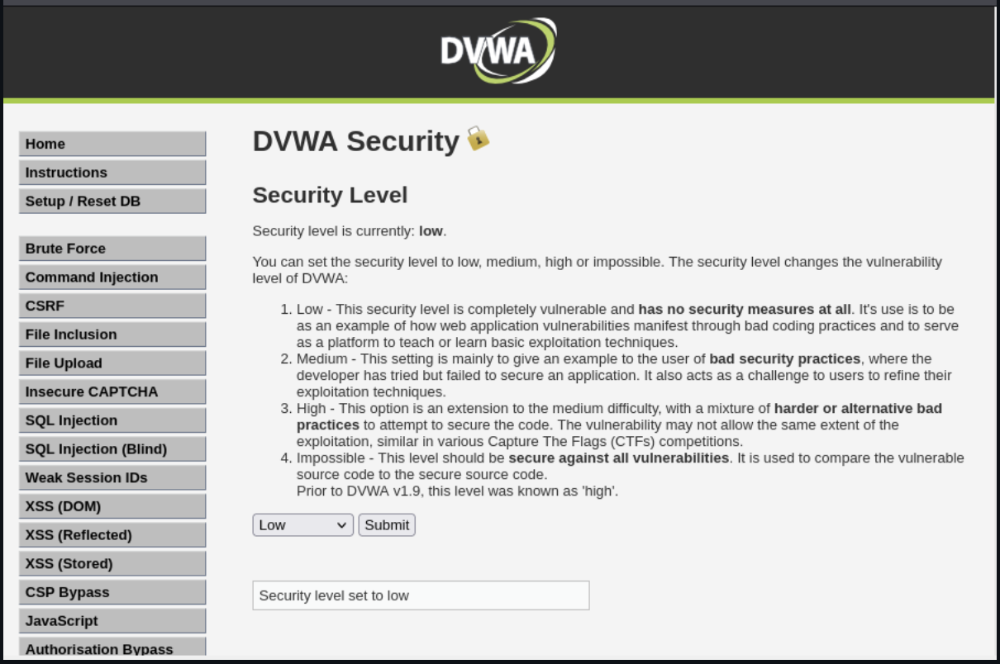
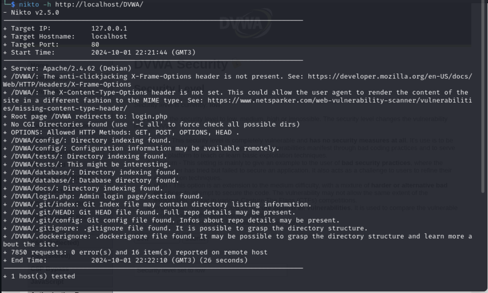
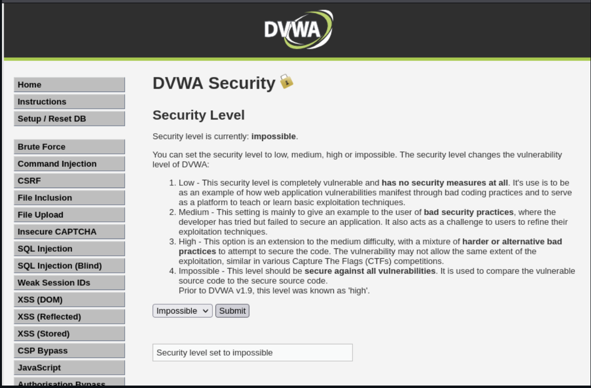
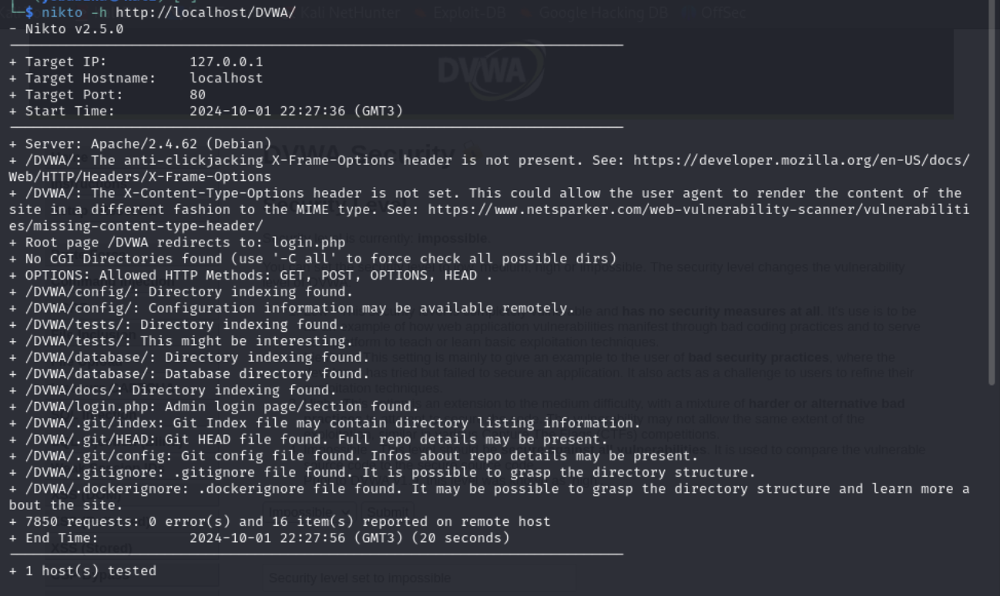

---
## Front matter
lang: ru-RU
title: personal presentation№4
author: Георгес Гедеон
institute: РУДН, Москва, Россия

date: 05 октября 2024

## Formatting
toc: false
slide_level: 2
theme: metropolis
header-includes: 
 - \metroset{progressbar=frametitle,sectionpage=progressbar,numbering=fraction}
 - '\makeatletter'
 - '\beamer@ignorenonframefalse'
 - '\makeatother'
aspectratio: 43
section-titles: true
---

## **Цель работы**

Приобретение практических навыков по использованию nikto - базового сканера безопасности веб-сервера.

## **Выполнение работы**

## Вывод
В рамках выполнения данной лабораторной работы я приобрела практический навык по использованию nikto - базового сканера безопасности веб-сервера.
