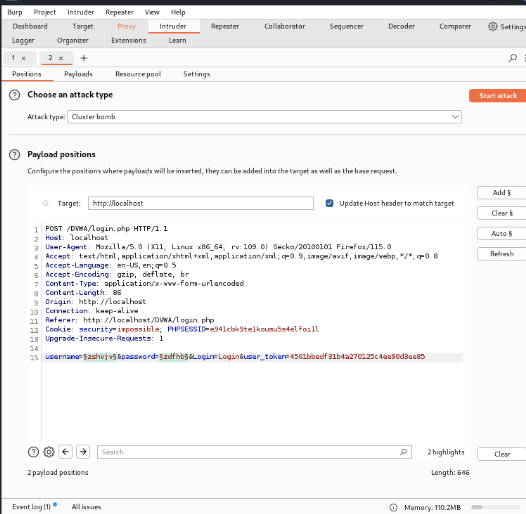

---
# Front matter
lang: ru-RU
title: "personal project#5"
subtitle: "Дисциплина: Основы информационной безопасности"
author: "Георгес Гедеон"

# Formatting
toc-title: "Содержание"
toc: true # Table of contents
toc_depth: 2
lof: true # Список рисунков
lot: true # Список таблиц
fontsize: 12pt
linestretch: 1.5
papersize: a4paper
documentclass: scrreprt
polyglossia-lang: russian
polyglossia-otherlangs: english
mainfont: PT Serif
romanfont: PT Serif
sansfont: PT Sans
monofont: PT Mono
mainfontoptions: Ligatures=TeX
romanfontoptions: Ligatures=TeX
sansfontoptions: Ligatures=TeX,Scale=MatchLowercase
monofontoptions: Scale=MatchLowercase
indent: true
pdf-engine: lualatex
header-includes:
  - \linepenalty=10 # the penalty added to the badness of each line within a paragraph (no associated penalty node) Increasing the value makes tex try to have fewer lines in the paragraph.
  - \interlinepenalty=0 # value of the penalty (node) added after each line of a paragraph.
  - \hyphenpenalty=50 # the penalty for line breaking at an automatically inserted hyphen
  - \exhyphenpenalty=50 # the penalty for line breaking at an explicit hyphen
  - \binoppenalty=700 # the penalty for breaking a line at a binary operator
  - \relpenalty=500 # the penalty for breaking a line at a relation
  - \clubpenalty=150 # extra penalty for breaking after first line of a paragraph
  - \widowpenalty=150 # extra penalty for breaking before last line of a paragraph
  - \displaywidowpenalty=50 # extra penalty for breaking before last line before a display math
  - \brokenpenalty=100 # extra penalty for page breaking after a hyphenated line
  - \predisplaypenalty=10000 # penalty for breaking before a display
  - \postdisplaypenalty=0 # penalty for breaking after a display
  - \floatingpenalty = 20000 # penalty for splitting an insertion (can only be split footnote in standard LaTeX)
  - \raggedbottom # or \flushbottom
  - \usepackage{float} # keep figures where there are in the text
  - \floatplacement{figure}{H} # keep figures where there are in the text
---

## **Цель работы**

Использование Burp Suite.

## **Выполнение работы**

Запустим необходимые для работы приложения такие, как Apache.

{width=70%}

Запускаем Burp Suite через терминал.

{width=70%}

{width=70%}

 Во вкладке Proxy убедимся, что Intercept включен.

{width=70%}

Далее в настройках браузера Mozilla устанавливаем Proxy на наш localhost 127.0.0.1 и также устанавливаем параметр true на network.proxy.allow_hijacking_localhost.

{width=70%}

{width=70%}

Теперь пытаемся зайти на страницу входа DVWA и видим, что наш сигнал был перехвачен Burp Suite.

{width=70%}

Нажимаем Forward и переходим на вкладку Target, где можно увидеть все истории запросов. Пробуем вести какой-нибудь пароль и логин на странице DVWA и наблюдаем, что запрос был отображен в Burp Suite.

{width=70%}

{width=70%}

Находим этот запрос в Target и отправляем во вкладку Intruder, нажав правую кнопку мыши и найдя команду Send to Intruder. Перейдя во вкладку Intruder, изменим тип аттак на Claster Bomb и отметим специальными знаками в запросе те данные, которые хотим подобрать, то есть логин и пароль. 

{width=70%}

В Payloads заполняем случайными данные для подбора логина и пароля.

{width=70%}

{width=70%}

После нажатия кнопки Start Attack программа начинает перебирать всевозможные комбинации для входа. Находим единственно верную комбинацию и отправляем в Repeater для повторной проверки и убеждаемся, что данные подходят .

{width=70%}

{width=70%}

{width=70%}

## Вывод

Мы научились пользоваться Burp Suite.