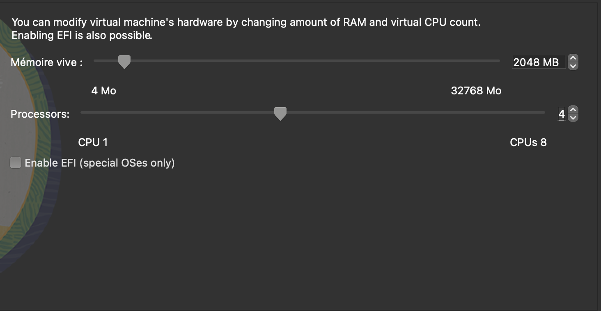
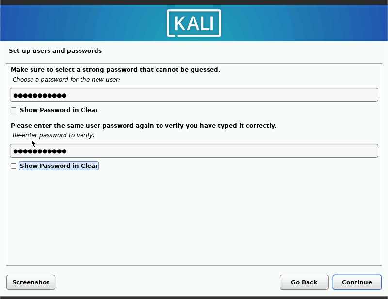

---
# Front matter
lang: ru-RU
title: "personal project#1"
subtitle: "Дисциплина: Основы информационной безопасности"
author: "Георгес Гедеон"

# Formatting
toc-title: "Содержание"
toc: true # Table of contents
toc_depth: 2
lof: true # Список рисунков
lot: true # Список таблиц
fontsize: 12pt
linestretch: 1.5
papersize: a4paper
documentclass: scrreprt
polyglossia-lang: russian
polyglossia-otherlangs: english
mainfont: PT Serif
romanfont: PT Serif
sansfont: PT Sans
monofont: PT Mono
mainfontoptions: Ligatures=TeX
romanfontoptions: Ligatures=TeX
sansfontoptions: Ligatures=TeX,Scale=MatchLowercase
monofontoptions: Scale=MatchLowercase
indent: true
pdf-engine: lualatex
header-includes:
  - \linepenalty=10 # the penalty added to the badness of each line within a paragraph (no associated penalty node) Increasing the value makes tex try to have fewer lines in the paragraph.
  - \interlinepenalty=0 # value of the penalty (node) added after each line of a paragraph.
  - \hyphenpenalty=50 # the penalty for line breaking at an automatically inserted hyphen
  - \exhyphenpenalty=50 # the penalty for line breaking at an explicit hyphen
  - \binoppenalty=700 # the penalty for breaking a line at a binary operator
  - \relpenalty=500 # the penalty for breaking a line at a relation
  - \clubpenalty=150 # extra penalty for breaking after first line of a paragraph
  - \widowpenalty=150 # extra penalty for breaking before last line of a paragraph
  - \displaywidowpenalty=50 # extra penalty for breaking before last line before a display math
  - \brokenpenalty=100 # extra penalty for page breaking after a hyphenated line
  - \predisplaypenalty=10000 # penalty for breaking before a display
  - \postdisplaypenalty=0 # penalty for breaking after a display
  - \floatingpenalty = 20000 # penalty for splitting an insertion (can only be split footnote in standard LaTeX)
  - \raggedbottom # or \flushbottom
  - \usepackage{float} # keep figures where there are in the text
  - \floatplacement{figure}{H} # keep figures where there are in the text
---

# Цель работы :

Установите дистрибутив Kali Linux в виртуальную машину.

# Задание :

В качестве среды виртуализации предлагается использовать VirtualBox.
Сайт Kali Linux: https://www.kali.org/
Учётные данные по умолчанию:
логин: root; пароль: toor.

# Выполнение лабораторной работы

Часть 1. Установка и настройка Виртуальной машины VirtualBox

1)Зайдите на официальный сайт VirtualBox и скачайте файл. Установите VirtualBox на свой компьютер. Я часто использую Linux.

2)Создайте виртуальную машину. Для этого нажмите «Создать». Имя нашей виртуальной машины — GedeonGeorges. Выберите наш образ диска Rocky Linux. Чтобы он распознал его как образ, сначала скачиваем UltraISO. 

3)Виртуальной машине требуется оперативная память. Выделяем 2048 МБ, это половина основной оперативной памяти. Мы также даем ему 4 процессора.

4)Выделяем под виртуальную машину 50 ГБ памяти.

5)Включаем виртуальную машину, выбор языка.

6)Выбор языка.

7)Базовое окружение выбираем Software.

8)Установите пароль для пользователя root.

9)Установка завершена. Перезагрузить.

10)Создайте систему Kali Linux. Установка завершена!

# Выводы

Я установил VirtualBox, поставил на виртуальную машину Kali Linux. Скомпилировал файлы из формата md в pdf и docx.